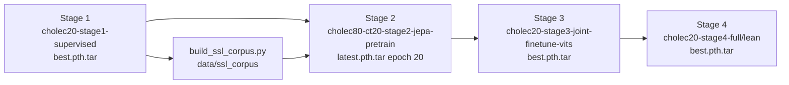

# Explore MOT training pipeline
_Exported on 6/20/2026 at 05:17:39 GMT+1 from Cursor (3.7.36)_

---

**User**

Explore /home/aimsgroupuol/AIMSgeneral/Gyanateet_tracking focusing on the MOT training pipeline:
1. core_app/mot/ structure and main.py entry
2. Stage 1-4 configs in configs/train_mot/
3. Training scripts in scripts/
4. How stages connect (checkpoints, resume paths)
5. Key model components (DETR, JEPA, OccuSolver, geometry)
Return file paths and brief descriptions of each stage.

---

**Cursor**

I'm Composer, mapping the MOT training pipeline: `core_app/mot/`, stage configs, scripts, and how checkpoints chain between stages.


I'm **Composer**, a language model trained by Cursor.

Here is a map of the MOT training pipeline in `/home/aimsgroupuol/AIMSgeneral/Gyanateet_tracking`.

---

## 1. `core_app/mot/` structure and entry point

**Entry:** `/home/aimsgroupuol/AIMSgeneral/Gyanateet_tracking/core_app/mot/main.py`

- Loads YAML via `--fname`
- Selects stage from `meta.stage` (`stage1_supervised`, `stage2_jepa`, `stage3_joint`, `stage4_full`, etc.)
- Builds `MOTCholecDataset` loaders (DDP-aware)
- Instantiates `MOTTrainer` and runs the epoch loop
- Checkpoint CLI: `--resume`, `--reset-optimizer`, `--reset-scheduler`, `--start-epoch`

**Package modules** (`/home/aimsgroupuol/AIMSgeneral/Gyanateet_tracking/core_app/mot/`):

| File | Role |
|------|------|
| `main.py` | CLI entry, dataloaders, DDP setup |
| `trainer.py` | Stage dispatch, optimizer, checkpoint I/O, training loop |
| `system.py` | `SurgicalMOTSystem` — encoder, neck, DETR, predictor, ReID, tracker, Stage 4 hooks |
| `data.py` | `MOTCholecDataset`, collate |
| `predictor.py` | Per-track hypernetwork (`PerTrackModelPredictor`) |
| `localizer.py` | `ClsDec` / `RegDec`, track localization loss |
| `manager.py` | `TrackManager` + Hungarian association |
| `track.py` | `Track`, memory bank |
| `assoc.py` | IoU/GIoU, cost matrix, Hungarian |
| `jepa.py` | GOT-JEPA wrapper (teacher/student, ProjNet, Expander) |
| `occusolver.py` | CoTracker + visibility gating |
| `geometry.py` | VGGT + null-space editor (GOT-Edit) |
| `augment.py` | `SurgicalCorruption` for Stage 2 student branch |
| `depth.py` | Depth-Anything path (lean Stage 4) |
| `eval.py`, `det_metrics.py` | Evaluation helpers |

**Trainer stage dispatch** (`trainer.py`):

- **Stage 1 / 3 / 4:** `model.forward(..., mode='train')` → `L_det + L_track + L_reid` (+ `L_occu`, `L_consist` in Stage 4)
- **Stage 2:** `encode_frames` + `GOTJEPAWrapper` only (no full `forward()` / OccuSolver training)

---

## 2. Stage configs (`configs/train_mot/dinov2/`)

All configs live under `/home/aimsgroupuol/AIMSgeneral/Gyanateet_tracking/configs/train_mot/dinov2/`.

### Stage 1 — Supervised DETR teacher

| Config | Description |
|--------|-------------|
| `cholec20-mot-stage1-supervised.yaml` | **Canonical Stage 1.** CholecTrack20, `dinov2_vits14`, deformable DETR, `detector_only: true` (DETR-only pseudo-label teacher), 100 epochs, `batch_size: 24` |
| `cholec20-mot-stage1-smoke.yaml` | 2-epoch smoke test variant |

**Output:** `outputs/mot/cholec20-stage1-supervised/`

### Stage 2 — GOT-JEPA SSL pretrain

| Config | Description |
|--------|-------------|
| `cholec80-ct20-stage2-jepa-pretrain.yaml` | **Canonical Stage 2.** Cholec80+CT20 SSL corpus (`data/ssl_corpus`), frozen teacher from Stage 1, trains student predictor + ProjNet + Expander, 30 epochs |
| `cholec80-ct20-stage2-jepa-pretrain-wandb.yaml` | Same as above with W&B naming |
| `cholec80-ct20-stage2-jepa-pretrain-vits.yaml` | Alternate output folder (`...-vits`) |
| `cholec20-mot-stage2-jepa-pretrain.yaml` | CT20-only Stage 2 (smaller corpus) |

**Output:** `outputs/mot/cholec80-ct20-stage2-jepa-pretrain/` (paused at epoch 20 per project notes)

### Stage 3 — Joint MOT fine-tune

| Config | Description |
|--------|-------------|
| `cholec20-mot-stage3-joint-finetune-vits.yaml` | **Recommended ViT-S path.** CT20, full MOT losses (`track` + `reid`), loads Stage 2 `latest.pth.tar` |
| `cholec20-mot-stage3-joint-finetune.yaml` | ViT-B variant (`dinov2_vitb14`), loads `cholec20-stage2-jepa-pretrain/best.pth.tar` |

**Output:** `outputs/mot/cholec20-stage3-joint-finetune-vits/` or `...-joint-finetune/`

### Stage 4 — Full GOT stack

| Config | Description |
|--------|-------------|
| `cholec20-mot-stage4-full.yaml` | VGGT geometry + OccuSolver + consistency losses, `batch_size: 1` |
| `cholec20-mot-stage4-lean.yaml` | CoTracker3 + Depth-Anything (no VGGT), `stage: stage4_lean`, ViT-S |
| `cholec20-mot-stage4-got-edit.yaml` | GOT-Edit geometry variant (`stage4_got_edit`) |

**Output:** `outputs/mot/cholec20-stage4-full/`, `...-lean-vits/`, `...-got-edit/`

---

## 3. Training scripts (`scripts/`)

| Script | Purpose |
|--------|---------|
| `train_stage1_ddp_3gpu.sh` | **Primary Stage 1 launcher** — `surgi_track` env, auto GPU count, `torchrun` or single-GPU |
| `train_stage1_gb10_1gpu.sh` | GB10 single-GPU Stage 1 |
| `run_mot_stage1.sh` | Single-GPU Stage 1 (legacy `dino_wm` env) |
| `run_mot_stage2.sh` | Stage 2 with `--resume` Stage 1 checkpoint |
| `run_mot_stage3.sh` | Stage 3 with `--resume` Stage 2 checkpoint |
| `run_mot_stage4.sh` | Stage 4 with `--resume` Stage 3 checkpoint |
| `run_full_pipeline.sh` | Stage 1 DDP → `build_ssl_corpus` → Stage 2 DDP |
| `build_ssl_corpus.py` | Pseudo-label Cholec80 + unified `data/ssl_corpus` for Stage 2 |
| `build_ssl_corpus_fast.sh`, `build_ssl_corpus_3gpu.sh` | Parallel corpus builders |
| `eval_checkpoint.py`, `validate_model_outputs.py` | Eval / validation utilities |

**Invocation pattern:**

```bash
python -m core_app.mot.main --fname <config.yaml> --devices cuda:0 [--resume <ckpt>] [--reset-optimizer] [--start-epoch 0]
```

---

## 4. How stages connect (checkpoints and resume)



**Checkpoint wiring:**

| Transition | Config key / CLI | Typical path |
|------------|------------------|--------------|
| → Stage 2 teacher init | `meta.load_checkpoint` (trainer init) | `outputs/mot/cholec20-stage1-supervised/best.pth.tar` |
| → Stage 2 (scripts) | `--resume` (also passed in `run_mot_stage2.sh`) | Same Stage 1 `best.pth.tar` |
| → Stage 3 | `meta.load_checkpoint` + `--resume --reset-optimizer --start-epoch 0` | `outputs/mot/cholec80-ct20-stage2-jepa-pretrain/latest.pth.tar` |
| → Stage 4 | `meta.load_checkpoint` + `--resume` | `outputs/mot/cholec20-stage3-joint-finetune-vits/best.pth.tar` (lean) or `...-joint-finetune/best.pth.tar` (full) |

**Two loading mechanisms:**

1. **Stage 2 init:** `MOTTrainer.__init__` calls `_load_stage1_weights_for_jepa(meta.load_checkpoint)` — loads backbone + frozen teacher predictor.
2. **All stages via CLI:** `main.py` → `trainer.load_checkpoint(--resume)` — loads `model`, optional `jepa` state, optimizer/scheduler unless reset.

**Recommended Stage 3 launch** (from `cholec20-mot-stage3-joint-finetune-vits.yaml` comments):

```bash
python -m core_app.mot.main \
  --fname configs/train_mot/dinov2/cholec20-mot-stage3-joint-finetune-vits.yaml \
  --devices cuda:0 \
  --resume outputs/mot/cholec80-ct20-stage2-jepa-pretrain/latest.pth.tar \
  --start-epoch 0 --reset-optimizer
```

**Prerequisite between Stage 1 and 2:**

```bash
python -m scripts.build_ssl_corpus \
  --stage1_config configs/train_mot/dinov2/cholec20-mot-stage1-supervised.yaml \
  --stage1_checkpoint outputs/mot/cholec20-stage1-supervised/best.pth.tar \
  --out_root data/ssl_corpus
```

---

## 5. Key model components by stage

### DETR (Stage 1 + 3 + 4)

- **Files:** `core_app/models/deformable_detr_head.py` (`DeformableSurgicalToolDetector`), `core_app/models/detr_head.py` (`SurgicalToolDetector`)
- **Wiring:** `system.py` — birth-only detection on current frame neck features
- **Stage 1:** `detector_only: true` — trains DETR for pseudo-labels; track/ReID weights = 0
- **Config:** `detr.use_deformable_detr: true` (ViT-S pipeline); must match across Stages 1→2→3 for checkpoint compatibility

### Per-track predictor + localizer (Stage 1, 3, 4)

- **Files:** `predictor.py`, `localizer.py`, `manager.py`
- Hypernetwork filter `ω` convolved over feature map → `ClsDec`/`RegDec` → `L_track`
- Stage 1: in graph but not trained when `detector_only`

### JEPA (Stage 2)

- **File:** `jepa.py` — `GOTJEPAWrapper`
- Teacher = frozen copy of Stage-1 `PerTrackModelPredictor`
- Student sees **corrupted** current frame (`augment.SurgicalCorruption`)
- Losses: `L_inv` (MSE to teacher) + `L_cov` (VICReg-style off-diagonal covariance)
- Stage 2 uses `encode_frames` only; encoder/neck/DETR/ReID frozen

### OccuSolver (Stage 2 gating config, Stage 4 training)

- **File:** `occusolver.py` — CoTracker (frozen) + `light_trans`, `VisHead`, Gaussian visibility maps
- **Stage 2 yaml:** `use_occusolver: true`, `occusolver.freeze: true` (visibility for pseudo-label gating; not trained in `_step_stage2_jepa`)
- **Stage 4:** `L_occu` BCE vs CoTracker teacher, optional `occu_gate_features`

### Geometry (Stage 4)

- **File:** `geometry.py` — `VGGTWrapper`, `GatedFusion`, `NullSpaceEditor`, geometry predictor
- `ω_final = ω_sem + P_null(Δ)` — perturbation in semantic null space
- **Stage 4 full:** `use_geometry: true`, `consist_weight` (cos-sim between ω with/without geo)
- **Stage 4 lean:** `use_geometry: false`, depth via OccuSolver (`use_depth: true`)

### Top-level assembly

- **File:** `system.py` — `SurgicalMOTSystem`
- Pipeline: DINOv2 encoder → FPN neck → DETR + per-track predictor → Hungarian `TrackManager` → ReID
- Stage flags: `stage_flags.use_geometry`, `stage_flags.use_occusolver`

---

## Stage summary (one line each)

| Stage | `meta.stage` | Data | Trains | Frozen | Checkpoint in |
|-------|--------------|------|--------|--------|-----------------|
| **1** | `stage1_supervised` | CholecTrack20 | Deformable DETR (detector-only) | Encoder (typical) | `cholec20-stage1-supervised/best.pth.tar` |
| **2** | `stage2_jepa` | `data/ssl_corpus` (Cholec80 pseudo + CT20 real) | Student predictor, ProjNet, Expander | Encoder, neck, DETR, ReID, teacher | `cholec80-ct20-stage2-jepa-pretrain/latest.pth.tar` |
| **3** | `stage3_joint` | CholecTrack20 | DETR, predictor, ReID, neck | Encoder | `cholec20-stage3-joint-finetune-vits/best.pth.tar` |
| **4** | `stage4_full` / `stage4_lean` / `stage4_got_edit` | CholecTrack20 | Above + OccuSolver heads (+ geometry in full) | VGGT, CoTracker, encoder | `cholec20-stage4-*/best.pth.tar` |

**Note:** ViT-S (`dinov2_vits14`, dim=384) is the active backbone for Stages 1–3 and lean Stage 4. `cholec20-mot-stage4-full.yaml` still references `dinov2_vitb14` — use the ViT-S Stage 3 checkpoint with `stage4-lean` for a consistent chain.

