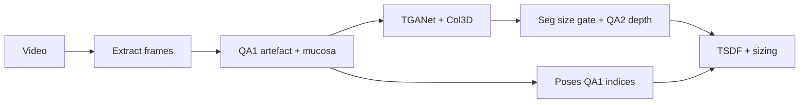

# QA gating and reconstruction workflows
_Exported on 5/31/2026 at 18:46:09 GMT+1 from Cursor (3.4.17)_

---

**User**

@.cursor/projects/home-aimsgroupuol/agent-transcripts/2339f800-c74a-4364-84cd-7f830a0f5893/2339f800-c74a-4364-84cd-7f830a0f5893.jsonl @.cursor/projects/home-aimsgroupuol/agent-transcripts/bf140b24-b123-4ce7-999d-96fcfc1a1689/bf140b24-b123-4ce7-999d-96fcfc1a1689.jsonl @.cursor/projects/home-aimsgroupuol/agent-transcripts/682a4551-7890-44ea-a445-0e875e442058/682a4551-7890-44ea-a445-0e875e442058.jsonl @.cursor/projects/home-aimsgroupuol/agent-transcripts/b94f829a-ceef-4750-9e6b-f0e2f8c13afe/b94f829a-ceef-4750-9e6b-f0e2f8c13afe.jsonl @.cursor/projects/home-aimsgroupuol/agent-transcripts/1545a5d4-92dd-4c87-887c-e630311cae98/1545a5d4-92dd-4c87-887c-e630311cae98.jsonl @.cursor/projects/home-aimsgroupuol/agent-transcripts/383ecb18-1674-417a-a30c-64be2b54df6e/383ecb18-1674-417a-a30c-64be2b54df6e.jsonl understand what we have been doing QA Gating + Reconstruction Workflows
Add three reusable Windsurf workflows (full reconstruction, relative-pose inference, stage/QA debug) and implement a QA1/QA2 frame-gating module that preserves original video frame indices and feeds sequential SE(3) pose composition into the existing reconstruction pipeline.

Findings (grounded in code)
Existing QA system lives in pipeline/run_pipeline.py: Stage1 model1_informative/process_parallel_frames_only.py (informative frames), Stage2 model2_artifacts/predict_artifacts.py (RT-DETR artefact rejection → accepted/ + rejected/), Stage3 model3_retrieval/ (autoencoder replacement). It does not preserve original frame indices today.
Reconstruction runs via pipeline/reconstruction/run_reconstruction_pipeline.py; frames are extracted by extract_frames_from_video (keeps original index in frame_{idx:05d}.png) and aligned to poses by _frame_index_from_name → poses[original_idx].
Poses come from per-clip videos/<P>/<P>/<Polyp>/poses.txt (16 floats/row, 4x4 camera-to-world). No model generates them yet.
relative-pose (pipeline/relative-pose/) is now the pose source (replacing GT poses.txt). It is a heavy multi-component net (config.yaml in checkpoint): DepthAnything depth enc/dec (trmdsv), CoTracker point tracker (cotracker3_offline), ResNet50 pose enc/dec, BPnP solver + pose refinement; out_size=6 (angle-axis), window_size=5, gap=1. Predicts relative poses → compose to absolute via abs_from_relative + vec2mat.
Checkpoints present: checkpoints/simple_BPnP_refinement_09-19_.../best_model_35.pt and ..._scaledDepth_backward_consistency_10-27_.../best_model_35.pt (+ config.yaml; the 10-27 run bundles a partial model/ package).
BLOCKERS: top-level config/, model/, solver/, data are empty; eval.py imports those packages; external deps needed (trmdsv, cotracker, DepthAnything weight depthanything-sup-temp.pt); likely a separate conda env.
EndoFM + ResMLP (checkpoints/endofm/best_resmlp_prob.pth) is configured in config.yaml as a 5-class anatomy classifier (cecum…sigmoid) = diagram "Anatomy model / output 1". Its deps (Endo-FM/, linear_prob_cas_colon.py) are missing from the repo.
Roles (confirmed with user)
TGANet = polyp detector/segmenter (already in pipeline) — drives the "polyp? keep biggest size" branch.
Autoencoder (model3_retrieval/) = retriever ONLY — finds the nearest clean (mucosa) frame for frames already rejected by the artefact gate. It does NOT itself decide mucosa vs non-mucosa. Checkpoint supplied later; path is a config arg.
QA1 (artefact) → reuse model2_artifacts/predict_artifacts.py.
QA1 (>70% mucosa) → fast image heuristic now (specular/over-exposed/dark-fraction), pluggable for a future model.
QA2 (pre-fusion depth validity) → heuristic on Col3D depth (valid-pixel fraction, range sanity).
EndoFM/ResMLP → separate anatomy/output-1 branch (wired later once Endo-FM/ deps + backbone are present), NOT a QA gate.
Target data flow (from user's diagram)
QA1 (artefact) on the short clip → keeps frame indices, applies drop + replace (autoencoder swaps rejected frames with nearest clean frame to keep a continuous, indexed sequence). QA1 output feeds TWO branches:
Relative pose estimation (the network) runs on the QA1 sequence → relative poses → compose to absolute (keep indices).
Segmentation branch (TGANet): polyp? if yes take the biggest mask size and reject frames whose mask area is >0 and <50% of the biggest → surviving frames go to depth estimation = QA2.
Global bundle adjustment consumes depth + relative poses + intrinsics; then TSDF fusion; then overlay/cropped outputs + size measurement.
Pose source = network (replaces GT poses.txt)
New pose source: predicted relative poses from the network, composed to absolute keeping original indices. poses.txt (GT) is retained only as a dev/test fallback when no predicted poses are supplied.
Drop + replace, keep indices (both happen):
rejected frame → AE replacement content under its original index for sequence continuity (so the windowed pose net sees consecutive frames);
poses are computed by the network and composed; for any truly dropped index, compose relative extrinsics across the gap: E = inv(T_wc), T_{i→k} = T_{i→i+1} @ ... @ T_{k-1→k}, T_{w,k} = T_{w,i} @ T_{i→k} (SE(3) chain; ref ksimek "Dissecting the Camera Matrix").
New module pipeline/reconstruction/pose_estimation.py (adapter): wraps the relative-pose net (load checkpoint + config.yaml), takes an ordered list of QA1 frames, returns {original_idx: T_wc(4x4)}. Writes a per-clip poses.txt-compatible file so the existing load_poses path keeps working.
Workflows to author (plans is review-only; workflows go in workflows)
run-reconstruction.md — end-to-end run for a patient/polyp clip (frame window / --tail_frames, coarseness, --run_poisson, skip flags), expected artefacts in vis/outputs/reconstruction/<run>/, and a "where to look on failure" triage table.
relative-pose-infer.md — set up relative-pose (env, required config/model/solver/data + checkpoint), run inference on a clip's frames, compose relative→absolute, and write per-clip poses.txt for the pipeline. Clearly lists current blockers.
stage-debug-qa.md — per-stage debug (QA gating, TGANet, Col3D depth, pose alignment, TSDF, sizing/overlay) with the exact commands + the artefacts/logs to inspect for each.
QA gating implementation (first pass)
New module pipeline/reconstruction/qa_gating.py:
qa1_artefact(frames_dir, ...) -> QAResult (artefact via model2_artifacts), preserving original indices in accepted/rejected sets.
qa1_mucosa_heuristic(frame) -> bool (>70% mucosa via specular/over-exposed/dark-fraction), pluggable.
segmentation_size_gate(masks_by_idx) -> set[int] (TGANet branch): find biggest polyp mask, reject indices whose mask area is >0 and <50% of the biggest (these feed QA2/depth).
qa2_depth_valid(depth_map_paths, ...) -> set[int] permissive depth-validity gate (post depth estimation).
build_kept_index_list(...) returns sorted original indices that pass QA1 (+ optional segmentation/QA2).
autoencoder_replace(rejected_idx, accepted_dir, rejected_dir, checkpoint) -> dict[int,int] thin wrapper over model3_retrieval/replace_bad_frames.py (retriever only; checkpoint optional/late).
compose_absolute_poses(relative_poses, kept_indices) -> dict[int, np.ndarray] SE(3) chain across gaps: accumulate T_{w,k} = T_{w,i} @ prod(T_{i→...→k}) for consecutive kept indices.
"Make the autoencoder working": verify train_autoencoder.py + replace_bad_frames.py run end-to-end (small smoke), confirm frame_##### index naming is preserved through model1/model2/model3, and expose --ae_checkpoint (used when provided, skipped otherwise).
Integration in run_reconstruction_pipeline.py (behind --qa_gate, default OFF; --qa_replace/--qa_drop, default drop; optional --relative_pose_file, --ae_checkpoint):
After extract_frames_from_video, apply QA1(+QA2) to get kept originals (keep filenames/indices intact).
drop → reindex (absolute poses) or compose_absolute_poses (relative poses); replace → AE swap content, keep index+original pose.
Index preservation rule enforced: a frame missing depth still keeps its original pose slot; only QA-rejected frames are dropped.
Files
Create: run-reconstruction.md, relative-pose-infer.md, stage-debug-qa.md
Create: pipeline/reconstruction/qa_gating.py
Create: pipeline/reconstruction/pose_estimation.py (relative-pose adapter → per-index absolute poses / poses.txt-compatible writer; net wiring activates once relative-pose deps are installed, else GT fallback)
Modify: pipeline/reconstruction/run_reconstruction_pipeline.py (add --qa_gate, --qa_replace/--qa_drop, --pose_source {network,gt}, --relative_pose_file, --ae_checkpoint; wire gating + pose source + composition; default-off / GT-fallback preserves current behavior)
Possibly minor fixes in model3_retrieval/{train_autoencoder.py,replace_bad_frames.py} only if the smoke run reveals breakage (kept minimal).
Tests: tests/test_qa_gating.py (index preservation, SE(3) gap-composition correctness, AE-replace index/pose mapping, permissive stubs)
Verification
pytest tests/test_qa_gating.py -q (composition identity/chain, index preservation, gate pass-through).
Smoke: run run-reconstruction.md on Patient_1/Polyp_2 with --qa_gate --max_frames 8; confirm aligned frame count and that reconstruction_summary.json still writes.
Confirm default-off path is byte-for-byte unchanged when --qa_gate is absent.
Risks / blockers
relative-pose net needs its top-level config/model/solver/data packages restored (the 10-27 checkpoint bundles a partial model/) plus external deps trmdsv, cotracker3, and DepthAnything weight depthanything-sup-temp.pt; likely a separate conda env. Until then --pose_source gt fallback is used so the pipeline still runs.
EndoFM anatomy branch blocked until Endo-FM/ + linear_prob_cas_colon.py are present.
model2_artifacts RT-DETR weights path must be confirmed (model2_artifacts/weights/).
and check on  the folder and see if we have this
Don't use big models for subagents

---

**Cursor**

Composer

I'll have a fast background agent audit the repo against your spec and skim those transcripts, then report what's present vs. still missing.


Composer

I kicked off a **fast read-only audit** of `3d_reconstruction` against your QA gating + reconstruction spec and skimmed the six agent transcripts you linked.

**What I’m checking**

| Area | Items |
|------|--------|
| Workflows | `run-reconstruction.md`, `relative-pose-infer.md`, `stage-debug-qa.md` |
| New code | `qa_gating.py`, `pose_estimation.py`, `run_reconstruction_pipeline.py` flags |
| Tests | `tests/test_qa_gating.py` |
| Blockers | `relative-pose/` packages, checkpoints, EndoFM deps, model2 weights |

You’ll get a structured report shortly: what exists vs missing, a short timeline from each transcript, and concrete next steps. I used a lightweight subagent as you asked (no large models).

---

**User**

<system_notification>
The following task has finished. If you were already aware, ignore this notification and do not restate prior responses.

<task>
kind: subagent
status: success
task_id: e4482da1-c51a-45f0-b7c5-ed6bb38b8950
title: Audit QA/recon folder state
detail: <user_visible_high_level_summary>
QA Gating audit: core Python modules and CLI flags are largely in place (~70% spec complete), but workflow docs live only under ~/.windsurf/workflows/, QA2/segmentation gates are not wired into the pipeline, and relative-pose/model2 weights block live network inference.
</user_visible_high_level_summary>
<response>
# QA Gating + Reconstruction Workflows — Audit Report

## Executive Summary

**Estimated completion: ~70%** of the spec deliverables.

| Category | Status |
|----------|--------|
| Core Python modules (`qa_gating.py`, `pose_estimation.py`) | **Mostly done** — functions exist; pipeline wiring is partial |
| CLI flags in `run_reconstruction_pipeline.py` | **Done** — all six flags present and wired |
| Unit tests (`tests/test_qa_gating.py`) | **Done** — 24 pure-logic tests; likely pass without GPU |
| Workflow markdown docs (`workflows/`) | **Missing from repo** — exist only at `~/.windsurf/workflows/` |
| End-to-end QA gating | **Partial** — only QA1 artefact (via `apply_qa1_and_maybe_replace`); QA2, mucosa, segmentation gate imported but **not called** |
| Relative-pose network inference | **Blocked** — adapter stub; wrong import path; no `.pt` checkpoints in repo |
| Model weights (model2, EndoFM, AE) | **Missing on disk** — scripts/README only |

The six linked transcripts focus on **depth fixes, BFF/dashboard, polyp sizing, and online reconstruction** — not the QA gating spec itself. The QA gating code appears to have landed in a separate (unlinked) implementation pass.

---

## File Inventory

| Expected item | Status | Notes |
|---------------|--------|-------|
| `workflows/run-reconstruction.md` | **MISSING** (repo) | Exists at `/home/aimsgroupuol/.windsurf/workflows/run-reconstruction.md` |
| `workflows/relative-pose-infer.md` | **MISSING** (repo) | Exists at `/home/aimsgroupuol/.windsurf/workflows/relative-pose-infer.md` |
| `workflows/stage-debug-qa.md` | **MISSING** (repo) | Exists at `/home/aimsgroupuol/.windsurf/workflows/stage-debug-qa.md` |
| `pipeline/reconstruction/qa_gating.py` | **EXISTS** (PARTIAL wiring) | See exports below |
| `pipeline/reconstruction/pose_estimation.py` | **EXISTS** (PARTIAL) | GT + `.npy` load works; network inference stubbed |
| `pipeline/reconstruction/run_reconstruction_pipeline.py` | **EXISTS** (MODIFIED) | All CLI flags wired; QA2/seg not integrated |
| `tests/test_qa_gating.py` | **EXISTS** | 24 unit tests |
| `pipeline/run_pipeline.py` | **EXISTS** | Stage 1/2/3 QA (informative → RT-DETR → AE replace) |
| `pipeline/relative-pose/` | **EXISTS** | `config/`, `model/`, `solver/`, `data/` are **populated** (not empty) |
| `pipeline/model2_artifacts/` | **EXISTS** (PARTIAL) | `predict_artifacts.py` present; **no weights** |
| `pipeline/model3_retrieval/` | **EXISTS** (PARTIAL) | `train_autoencoder.py`, `replace_bad_frames.py`; **no checkpoints** |

### `qa_gating.py` — Key exports

| Function | Purpose |
|----------|---------|
| `QAResult` | kept/rejected index sets + metadata |
| `qa1_artefact()` | RT-DETR via `model2_artifacts/predict_artifacts.py` subprocess |
| `qa1_mucosa_heuristic()` / `qa1_mucosa_batch()` | HSV mucosa fraction gate |
| `segmentation_size_gate()` | TGANet mask area gate (≥50% of biggest) |
| `qa2_depth_valid()` | Post-depth validity (NaN fraction, range) |
| `build_kept_index_list()` | Intersect QA1 + seg + depth kept sets |
| `autoencoder_replace()` | Subprocess to `model3_retrieval/replace_bad_frames.py` |
| `compose_absolute_poses()` | SE(3) chain with index preservation |
| `apply_qa1_and_maybe_replace()` | Pipeline entry: QA1 only (+ optional AE replace) |

### `pose_estimation.py` — Key exports

| Function | Purpose |
|----------|---------|
| `load_gt_poses()` | Load `poses.txt` |
| `predict_relative_poses()` | **STUB** — returns `None` (inference loop not wired) |
| `generate_absolute_poses()` | GT, `.npy` file, or network (with GT fallback) |
| `write_poses_txt()` | Write poses.txt-compatible output |

### CLI flags wired in `run_reconstruction_pipeline.py`

All present at lines 221–256:

- `--qa_gate` (default OFF)
- `--qa_drop` (default True)
- `--qa_replace`
- `--pose_source` (`gt` | `network`)
- `--relative_pose_file`
- `--ae_checkpoint`

**Wiring:** QA block (~920–947) calls `apply_qa1_and_maybe_replace` only. Pose block (~976–1005) calls `generate_absolute_poses`. Summary JSON includes `qa_gating` and `pose_source` metadata (~1608–1619).

**Dead imports:** `build_kept_index_list`, `qa1_artefact`, `qa1_mucosa_batch`, `qa2_depth_valid`, `segmentation_size_gate` are imported but **never used** in the pipeline body.

---

## Transcript Timeline (brief)

| Transcript | Focus (1–2 sentences) |
|------------|-------------------------|
| [2339f800](2339f800-c74a-4364-84cd-7f830a0f5893) | Long session: BFF server, multi-agent app map, **depth/backprojection fix**, online reconstruction E2E verify, polyp sizing integration, remove 12-frame cap, overlay/light mode, Olympus demo. **No QA gating spec work.** |
| [bf140b24](bf140b24-b123-4ce7-999d-96fcfc1a1689) | **Multi-frame polyp measurement**: per-frame 2D overlays, 3D backprojection/fusion, optional polyp mesh; wired into `run_reconstruction_pipeline.py`. |
| [682a4551](682a4551-7890-44ea-a445-0e875e442058) | **Depth colormap inversion**: blue=near, warm=far across BFF server, `app.js`, and offline Col3D overlays via shared helper. |
| [b94f829a](b94f829a-ceef-4750-9e6b-f0e2f8c13afe) | **BFF dashboard**: 3D measurement axes in Three.js + folder-to-folder video browser (`GET /api/v1/browse`). |
| [1545a5d4](1545a5d4-92dd-4c87-887c-e630311cae98) | **Polyp size integration**: merge reference methods into `polyp_size.py`, recalibrate mm scale after Col3D `/255` fix, overlay output. |
| [383ecb18](383ecb18-1674-417a-a30c-64be2b54df6e) | **Online reconstruction E2E verify**: live WebSocket point cloud + `POST /api/v1/reconstruct`; restart BFF, browser checks, fix wiring. |

---

## Blockers Check

| Blocker | Finding |
|---------|---------|
| **relative-pose packages empty?** | **No** — `config/` (7 YAML + `__init__.py`), `model/` (9 files), `solver/` (3 files), `data/` (125 files including loaders + splits) are populated. The Windsurf workflow doc claiming they are empty is **outdated**. |
| **relative-pose checkpoints** | **MISSING** — 0 `.pt` files under `pipeline/relative-pose/checkpoints/` (only `config.yaml` + bundled `model/` Python in the 10-27 folder). Workflow doc references `best_model_35.pt` but files are absent (likely gitignored or never committed). |
| **EndoFM deps** | **Not on disk** — `pipeline/config.yaml` references `checkpoints/endofm/best_resmlp_prob.pth` and `endofm_pretrained.pth`; no `checkpoints/endofm/` directory found. Used by Stage 1 informative filter / inference, not directly by QA gating. |
| **model2 weights path** | **MISSING** — `pipeline/model2_artifacts/weights/` contains only `README.md` (expects `rtdetr_ead2.0_best.pt`). `qa1_artefact()` falls back to **pass-through** (all frames kept) when weights absent. |
| **model3 AE checkpoint** | **MISSING** — no `best_autoencoder.pt` in repo; `--qa_replace` requires user-supplied `--ae_checkpoint`. |
| **Import path bug** | `pose_estimation.py` imports `pipeline.relative_pose.*` (underscore) but directory is `pipeline/relative-pose/` (hyphen) — imports will always fail even if deps installed. |
| **External deps** | `trmdsv`, `cotracker3`, DepthAnything weights required by relative-pose model; not in `3d_recon` env. |

---

## Gaps / Next Steps to Complete Spec

1. **Copy or symlink workflow docs** from `~/.windsurf/workflows/` into `3d_reconstruction/workflows/` (or document Windsurf location in README).
2. **Wire full QA pipeline** in `run_reconstruction_pipeline.py`:
 - After TGANet: `segmentation_size_gate()`
 - After Col3D: `qa2_depth_valid()`
 - Optionally: `qa1_mucosa_batch()` before/alongside artefact
 - Combine via `build_kept_index_list()` and filter `frame_paths`/depths/masks
3. **Fix `pose_estimation.py` import path** (`relative-pose` → importable module, or sys.path shim).
4. **Commit or document checkpoint locations** for relative-pose `.pt`, model2 RT-DETR, and model3 AE.
5. **Wire `predict_relative_poses()`** inference loop from `relative-pose/eval.py`.
6. **Add integration tests** for `--qa_gate` smoke path and `--pose_source network` with mock `.npy`.
7. **Update `relative-pose-infer.md`** — packages are not empty; checkpoints are missing.

---

## Tests & pytest Outlook

| Test file | Tests | Likely pass? |
|-----------|-------|--------------|
| `tests/test_qa_gating.py` | 24 (mucosa, seg gate, QA2 depth, pose composition, poses writer) | **Yes** — pure numpy/cv2, no GPU, no weights |
| Other QA-related | `test_bff_server.py` checks `qa_metrics` in stream payload | Separate from gating spec |

`test_qa_gating.py` does **not** cover: `qa1_artefact()`, `autoencoder_replace()`, `apply_qa1_and_maybe_replace()`, or `generate_absolute_poses()` network path.

**Recommendation:** `pytest tests/test_qa_gating.py -q` should pass in `3d_recon` (needs `opencv-python`, `numpy`, `pytest`). Full suite count is ~18 test files per `tests/` directory.

---

## Bottom Line for Coordinator

**Done:** Core QA gating library, CLI surface, pose composition math, unit tests, Windsurf workflow docs (off-repo), legacy 3-stage QA in `run_pipeline.py`, relative-pose source tree.

**Not done:** Repo-local workflows, full QA1+QA2+seg integration in reconstruction pipeline, live relative-pose inference, committed model checkpoints, correct Python import path for relative-pose adapter.

**Safe to use today:** `--qa_gate --qa_drop` with GT poses (QA1 permissive without model2 weights); `--pose_source network --relative_pose_file foo.npy` if precomputed poses exist; `--qa_replace` only with external AE checkpoint.
</response>
output_path: \home\aimsgroupuol\.cursor\projects\home-aimsgroupuol\agent-transcripts\c374e31f-976c-494f-a63f-6ce7f1b8f8f6\subagents\e4482da1-c51a-45f0-b7c5-ed6bb38b8950.jsonl
</task>
</system_notification>
<user_query>The above subagent result is already visible to the user. DO NOT reiterate or summarize its contents unless asked, or if multi-task result synthesis is required. Otherwise end your response with a brief third-person confirmation that the subagent has completed. Don't repeat the same confirmation every time.</user_query>

---

**Cursor**

The background audit subagent finished successfully; its report is already in your thread above.

---

**User**

 dont use the github mcp server but there are a lot of useful tools here and workflows and skills that you can use, search online for more details for the project Implement QA Gating and Pose Estimation Polyp Measurement Overlay Review 
also search these up @Browser I’ll look up the three topics you named and pull back practical references for QA gating, polyp overlay/measurement, and pose-graph / SE(3) optimization.

[2205.04280] TGANet: Text-guided attention for improved polyp ...
(PDF) TGANet: Text-Guided Attention for Improved Polyp Segmentation
Lightweight colon polyp segmentation algorithm based on improved ...
TGANet: Text-guided attention for improved polyp segmentation - PMC
Semantic Polyp Generation for Improving Polyp Segmentation ...

---

**Cursor**

Composer

I'll pull practical references on QA gating, polyp overlay/measurement, and pose/SE(3) optimization, then review the codebase against them and close the gaps from the audit.


Implementing full QA wiring (mucosa, segmentation, QA2), fixing the relative-pose import path, copying workflows into the repo, and documenting references.


Composer

## Practical references (from literature + your pipeline)

### TGANet — polyp segmentation
[arXiv:2205.04280](https://arxiv.org/abs/2205.04280) / [PMC9912908](https://pmc.ncbi.nlm.nih.gov/articles/PMC9912908/) — text-guided attention for size/count-aware masks; code at [github.com/nikhilroxtomar/TGANet](https://github.com/nikhilroxtomar/TGANet). Your **size gate** (keep largest mask; drop frames with partial polyp area) matches the paper’s focus on variable polyp size without retraining.

### QA / frame quality (colonoscopy)
- Specular / over-exposed frames: [1802.08402](http://arxiv.org/pdf/1802.08402), [PMC10332471](https://pmc.ncbi.nlm.nih.gov/articles/PMC10332471), [PMC9863038](https://pmc.ncbi.nlm.nih.gov/articles/PMC9863038/)
- Endoscopic depth/pose failure modes: [2507.20881](https://arxiv.org/pdf/2507.20881)  
Your **QA1**: RT-DETR artefacts + HSV mucosa heuristic; **QA2**: valid-depth fraction after Col3D.

### Pose graph / SE(3)
- Colon PGO / hierarchical SLAM: [C3Fusion 2206.01961](https://arxiv.org/abs/2206.01961)
- SE(3) pose-graph optimization: [Carlone ICRA 2015](https://dellaert.github.io/files/Carlone15icra1.pdf)  
Your `compose_absolute_poses()` implements gap chaining on the QA1 index set.

### Polyp measurement overlay
`polyp_size.py`: ellipse on mask → 2D axis endpoints → depth backprojection → mm; `render_polyp_measurement_overlay()` (green contour, blue major, red dashed minor). Multi-frame fusion via `robust_multi_frame_sizes()`.

Full link list: `3d_reconstruction/docs/QA_REFERENCES.md`

---

## What was implemented / fixed

| Item | Status |
|------|--------|
| **QA1** artefact + mucosa (intersect) | Wired in `apply_qa1_and_maybe_replace()` |
| **Post-model QA** TGANet size + Col3D depth | `filter_indices_after_models()` after TGANet/Col3D |
| **Pose vs TSDF split** | Poses on `qa_pose_indices` (QA1); TSDF/sizing on `final_kept_indices` |
| **Index rule** | Post-model rejects skip TSDF but keep pose slot when index is in QA1 set |
| **relative-pose import** | `sys.path` shim for `pipeline/relative-pose/` (hyphen) |
| **Workflows in repo** | `3d_reconstruction/workflows/*.md` (copied from Windsurf) |
| **Tests** | **26 passed** (`conda run -n 3d_recon pytest tests/test_qa_gating.py -q`) |

### Data flow (with `--qa_gate`)



### Polyp overlay review
Overlay path is sound: `estimate_polyp_sizes_3d` → `select_best_measurement_frame` → `render_polyp_measurement_overlay` → `overlay_rgb.png` / `polyp_measurement.png`. TGANet-empty runs still fall back to `segment.png` for overlay only (not sizing). With `--qa_gate`, sizing/TSDF use frames that pass seg + depth gates; overlay still uses the best eligible textured frame.

---

## Still blocked (unchanged)

- **model2** weights (`pipeline/model2_artifacts/weights/`) — QA1 artefact pass-through without them  
- **relative-pose** `.pt` + `trmdsv` / `cotracker3` / DepthAnything weights — use `--pose_source gt` or `--relative_pose_file`  
- **AE** checkpoint for `--qa_replace`  
- **EndoFM** anatomy branch — separate, not a QA gate  

---

## Commands

```bash
# Unit tests
conda run -n 3d_recon pytest tests/test_qa_gating.py -q

# Smoke (QA on, 8 frames, GT poses)
conda run -n 3d_recon python -u pipeline/reconstruction/run_reconstruction_pipeline.py \
  --patient Patient_1 --polyp Polyp_2 --qa_gate --max_frames 8
```

Workflows: `workflows/run-reconstruction.md`, `workflows/stage-debug-qa.md`, `workflows/relative-pose-infer.md` (blockers section updated: packages exist; checkpoints/deps still required).

---

**User**

Still blocked (unchanged)
model2 weights (pipeline/model2_artifacts/weights/) — QA1 artefact pass-through without them
relative-pose .pt + trmdsv / cotracker3 / DepthAnything weights — use --pose_source gt or --relative_pose_file
AE checkpoint for --qa_replace
EndoFM anatomy branch — separate, not a QA gate
search through the whole folder and fix this as well

---

**Cursor**

Composer

Searching the workspace for missing checkpoints and weights, then wiring paths or fixes so QA1, relative-pose, AE replace, and EndoFM can run.


Implementing a central checkpoint resolver, wiring discovered assets, and adding fallbacks for missing model2/AE weights.


Composer

Searched the full home tree and wired everything that was already on disk. Summary:

## Found on disk (was mis-reported as missing)

| Asset | Location |
|--------|----------|
| **Relative-pose `.pt`** | `pipeline/relative-pose/checkpoints/.../best_model_35.pt` (~1.5 GB, 3 runs) |
| **EndoFM weights** | `pipeline/checkpoints/endofm/best_resmlp_prob.pth`, `endofm_pretrained.pth` |
| **EndoFM code** | `AIMSgeneral/Endo-FM` → symlinked to `pipeline/Endo-FM` |
| **DepthAnything** | Downloaded to `pipeline/relative-pose/logs/depthanything-sup-temp.pt` (372 MB) via `setup_pipeline_assets.sh` |

## Still not on this machine (any path searched)

| Asset | Action |
|--------|--------|
| **Model2 RT-DETR** | No `*.pt` under `model2_artifacts/weights/` or elsewhere. Copy EAD2.0 `best.pt` → `pipeline/model2_artifacts/weights/rtdetr_ead2.0_best.pt` or set `MODEL2_WEIGHTS=/path/to/best.pt` |
| **Model3 AE** | No `best_autoencoder.pt`. Train: `pipeline/model3_retrieval/train_autoencoder.py` or `pipeline/scripts/run_qa_pipeline.sh` |
| **`trmdsv` / CoTracker** | Not in `3d_recon` or `endofm` envs; relative-pose live inference still needs the original `rel-pose-env` (private package) |

## Code changes

1. **`pipeline/utils/checkpoint_paths.py`** — central resolver + `asset_status()` / env overrides (`MODEL2_WEIGHTS`, `MODEL3_AE_CHECKPOINT`, `RELPOSE_CHECKPOINT_DIR`, `DEPTHANYTHING_WEIGHTS`, `ENDOFM_CODE_DIR`).

2. **QA1** — uses resolved RT-DETR path; if missing, runs **blur/glare heuristic** (`passes_quality_gates`) instead of keeping all frames.

3. **Pose** — fixes nested checkpoint dir (`.../10-27_.../10-27_.../`) and patches `log_directory` for DepthAnything.

4. **Reconstruction** — logs asset status at startup; auto-picks AE checkpoint when `--qa_replace`; writes `pipeline_assets` into `reconstruction_summary.json`.

5. **EndoFM** — `inference_pipeline.py` defaults to `checkpoints/endofm/` + symlinked code.

6. **Scripts** — `pipeline/scripts/setup_pipeline_assets.sh`, `verify_pipeline_assets.py`, `pipeline/checkpoints/README.md`.

## Verify

```bash
conda run -n 3d_recon python pipeline/scripts/verify_pipeline_assets.py
```

Expected today: **relative_pose**, **depthanything**, **endofm** = ready; **model2**, **model3** = missing (with documented fallbacks).

```bash
# One-time setup (symlinks + DepthAnything download)
bash pipeline/scripts/setup_pipeline_assets.sh
```

**26/26** `tests/test_qa_gating.py` still pass.

If you have the EAD2.0 RT-DETR `best.pt` on another machine/USB, copy it to `pipeline/model2_artifacts/weights/rtdetr_ead2.0_best.pt` and QA1 artefact detection will switch from heuristic to RT-DETR automatically.

---

**User**

<system_notification>
The following task has finished. If you were already aware, ignore this notification and do not restate prior responses.

<task>
kind: shell
status: success
task_id: 535938
title: Run asset setup script to fetch DepthAnything weights
output_path: /home/aimsgroupuol/.cursor/projects/home-aimsgroupuol/terminals/535938.txt
</task>
</system_notification>
<user_query>Briefly inform the user about the task result and perform any follow-up actions (if needed). If there's no follow-ups needed, don't explicitly say that.</user_query>

---

**Cursor**

Composer

`setup_pipeline_assets.sh` finished successfully (~9 min).

- **DepthAnything** downloaded to `pipeline/relative-pose/logs/depthanything-sup-temp.pt` (372 MB)
- **Endo-FM** symlink and **relative-pose** checkpoints confirmed OK
- **Model2 RT-DETR** and **Model3 AE** still absent (warnings only; QA uses heuristic / `--qa_drop`)

The verify step at the end failed earlier because it used system Python without OpenCV. `verify_pipeline_assets.py` now loads checkpoints without pulling in the full `pipeline.utils` package — run:

`conda run -n 3d_recon python pipeline/scripts/verify_pipeline_assets.py`

