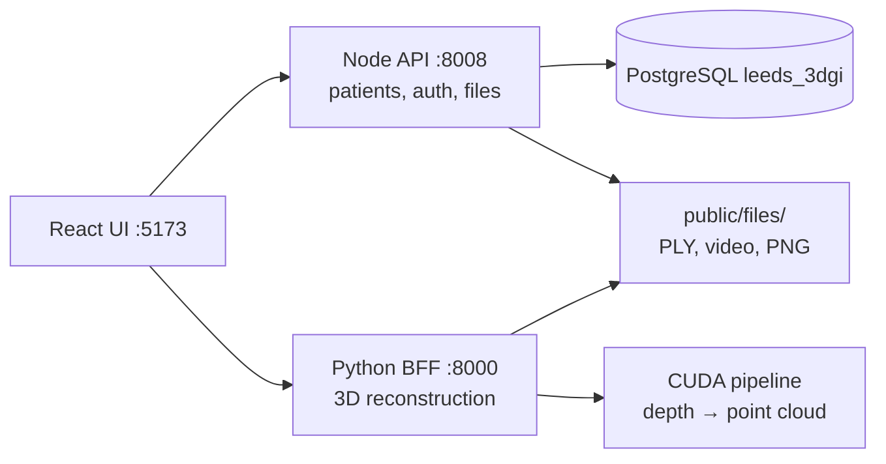
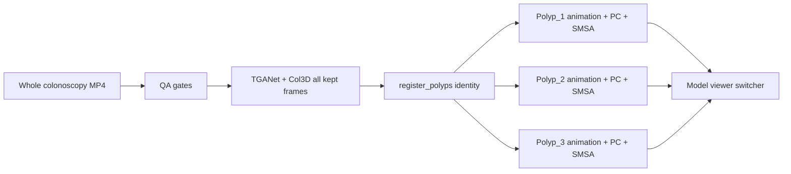

# Chat location inquiry
_Exported on 6/29/2026 at 11:16:56 GMT+1 from Cursor (3.9.16)_

---

**User**

can you check where all of the chats here

---

**Cursor**

Composer. I'll look for where chat transcripts and related history are stored in this workspace.


Composer.

Cursor stores agent chat transcripts on disk under your home directory, grouped by **workspace project**.

## Main location

```
/home/aimsgroupuol/.cursor/projects/<workspace-name>/agent-transcripts/
```

Each chat is a folder named with a UUID, containing a JSONL file:

```
agent-transcripts/
  <chat-uuid>/
    <chat-uuid>.jsonl          ← main conversation
    subagents/                 ← optional sub-agent runs
      <subagent-uuid>.jsonl
```

## Your workspaces

| Workspace | Top-level chats | Total `.jsonl` files (incl. subagents) |
|-----------|-----------------|----------------------------------------|
| `home-aimsgroupuol` | 27 | 173 |
| **`home-aimsgroupuol-endosight-3d`** (this project) | **14** | **104** |
| `home-aimsgroupuol-AIMSgeneral` | 10 | 57 |
| `home-aimsgroupuol-AIMSgeneral-Gyanateet-tracking` | 5 | 14 |
| `home-aimsgroupuol-3d-reconstruction` | 1 | 4 |

**Endosight 3D path:**
`/home/aimsgroupuol/.cursor/projects/home-aimsgroupuol-endosight-3d/agent-transcripts/`

## Recent Endosight chats (Jun 26–29)

| Date | UUID | First message (snippet) |
|------|------|-------------------------|
| Jun 29 07:55 | `c71c7fb7-...` | *this chat* — where are the chats |
| Jun 29 07:52 | `f4a649bf-...` | understand what's here / check folder (899 lines) |
| Jun 29 07:02 | `0861e6fc-...` | browser MCP point cloud inspection |
| Jun 28 17:17 | `e01f81a5-...` | browser error on Endosight |
| Jun 28 16:14 | `d0deb0c1-...` | BFF streaming inference GB10 |
| Jun 26 15:43 | `85f0ab72-...` | load up and run the website |

## Related Cursor data (same project folder)

```
/home/aimsgroupuol/.cursor/projects/home-aimsgroupuol-endosight-3d/
├── agent-transcripts/   ← chats
├── agent-tools/         ← tool call logs
├── terminals/           ← terminal session logs
├── canvases/            ← canvas artifacts
├── mcps/                ← MCP server configs
└── assets/              ← attached assets
```

## Notes

- These are **agent transcript logs** (JSONL), not the full Cursor UI chat history sidebar — that may also live in Cursor’s internal app state, which wasn’t found under `~/.config/Cursor` on this machine.
- Sub-agent runs (e.g. explore/bugbot tasks) are nested under `subagents/` inside a parent chat folder — that’s why Endosight has 14 top-level chats but 104 `.jsonl` files total.

I can list full titles/previews for all 14 Endosight chats, or search them for a specific topic if you want.

---

**User**

@\home\aimsgroupuol\endosight-3d\ can you understand what is happening here? @Browser 

---

**Cursor**

Composer. I'll explore the endosight-3d project and inspect what's running in the browser.


The browser shows a point-cloud load failure — tracing that path and how the three services connect.


Composer.

Here’s what’s going on in **endosight-3d** and what the browser is showing right now.

## What this project is

**Endosight 3D** is a clinical colonoscopy platform: upload a video clip → run depth reconstruction → view a 3D point cloud / mesh with polyp sizing.

It’s one repo with three services:



| Layer | Path | Role |
|-------|------|------|
| **Frontend** | `frontend/` | Leeds React UI, Three.js model viewer |
| **Node backend** | `leeds-3dgi-node-backend/` | Auth, patients, batches, static files |
| **BFF / pipeline** | `backend/pipeline/` | GPU reconstruction, meshing, sizing |

Start with: `cd /home/aimsgroupuol/endosight-3d && make dev`  
Login: `admin@leeds.com` / `admin123`

---

## What the browser shows right now

Open tab: **Model Viewer** for Patient 3, batch `56864dc5-0dab-4ffd-a47e-96f70d1e6b10`

- **Preview panel:** red error — *"Could not load point cloud from `/public/files/Patient_3/2026-06-28_17-40-42/Polyp_1/accumulated_pc.ply`"*
- **Video panel:** black (no video loaded)
- **Viewer tools:** disabled (Reset View, Screenshot, Measure, etc.) because the 3D asset failed to load
- **Polyp 1 card:** visible in Locations — API metadata loaded, but the ~154 MB PLY file did not

The API side is fine: batch metadata returns Polyp 1 with a valid `accumulated_pc` path and size `161848497` bytes. The failure is **static file serving**, not missing DB records.

---

## Root cause: wrong dev stack is running

All three live processes are from **`endosight-3d_exp`**, not canonical **`endosight-3d`**:

| Port | Process | Working directory |
|------|---------|-------------------|
| 5173 | Vite | `/home/aimsgroupuol/endosight-3d_exp/frontend` |
| 8008 | Node | `/home/aimsgroupuol/endosight-3d_exp/leeds-3dgi-node-backend` |
| 8000 | BFF | `/home/aimsgroupuol/endosight-3d_exp/backend` |

Patient 3 files exist only under **canonical** endosight-3d:

```
✅ /home/aimsgroupuol/endosight-3d/leeds-3dgi-node-backend/public/files/Patient_3/2026-06-28_17-40-42/Polyp_1/accumulated_pc.ply  (154 MB)
❌ /home/aimsgroupuol/endosight-3d_exp/leeds-3dgi-node-backend/public/files/Patient_3/  (empty)
```

Node serves files from `./public` relative to its cwd, so:

- `GET /public/files/Patient_3/.../accumulated_pc.ply` → **404**
- The viewer gets metadata from Postgres but can’t fetch the PLY

Both trees share the same Postgres DB (`leeds_3dgi`), so batch records point at files that only exist on disk in the canonical tree.

---

## Canonical vs experimental copy

| | `endosight-3d` | `endosight-3d_exp` |
|--|----------------|-------------------|
| **Role** | Canonical production tree | Experimental fork |
| **Patient files** | Has Patient_3 recon outputs | Empty Patient_3 folder |
| **BFF** | Current leeds routes | Different `bff/server.py`, `leeds/routes.py` |
| **Extra** | — | `backend/pipeline/anatomy/` module |

---

## Clinical flow (when it works)

1. **Login** → Node auth (`/v1/auth/login`)
2. **Patients** → list from Postgres
3. **Upload** → Node stores video → BFF runs reconstruction
4. **Outputs** → PLY, poses, segment PNG, sizes CSV → `public/files/Patient_X/...`
5. **Model viewer** → fetches `/v1/admin/patients/{id}/batches/{batchId}/files` → loads PLY in Three.js (`plyviewer.jsx`)

You’re on step 5 with valid API data but a 404 on the static file.

---

## How to fix the viewer

**Option A (recommended):** run the canonical stack

```bash
cd /home/aimsgroupuol/endosight-3d_exp && make stop   # or kill ports 5173/8000/8008
cd /home/aimsgroupuol/endosight-3d && make dev
```

Then reload the model viewer URL.

**Option B:** keep `endosight-3d_exp` running and copy/symlink patient files into its `leeds-3dgi-node-backend/public/files/`.

---

**Summary:** endosight-3d is a 3-service clinical 3D reconstruction platform. The browser error is a **path mismatch**: the DB and UI reference Patient 3 files under canonical `endosight-3d`, but the live Node server is serving from `endosight-3d_exp`, where those files don’t exist.

I can restart the canonical stack and confirm the point cloud loads in the browser if you want.

---

**User**

@\home\aimsgroupuol\endosight-3d_exp\ can you see what's this here

---

**Cursor**

Composer. I'll explore `endosight-3d_exp` and compare it to the canonical `endosight-3d` tree.


Composer.

Here’s what **`/home/aimsgroupuol/endosight-3d_exp`** is and how it relates to canonical **`endosight-3d`**.

## What it is

A **full local copy** of the Endosight 3D platform (~104 GB), created around **26 Jun 2026** as an experimental/sandbox tree. It has the same overall layout:

```
endosight-3d_exp/
├── backend/                 # BFF + GPU reconstruction pipeline
├── frontend/                # Leeds React UI
├── leeds-3dgi-node-backend/ # Express patient/auth API
├── scripts/                 # make dev, verify, etc.
├── agent_docs/              # Exported Cursor chat history (Jun 19)
└── docs/                    # Deployment docs (older subset)
```

It is **not** the canonical project. The README inside still points to `/home/aimsgroupuol/endosight-3d` as the real root.

---

## What’s running right now

**This copy is currently serving your dev stack:**

| Port | Service | CWD |
|------|---------|-----|
| 5173 | Vite (UI) | `endosight-3d_exp/frontend` |
| 8008 | Node API | `endosight-3d_exp/leeds-3dgi-node-backend` |
| 8000 | Python BFF | `endosight-3d_exp/backend` |

That’s why the model viewer broke earlier: Postgres has Patient 3 batch records, but the **files live under canonical** `endosight-3d/leeds-3dgi-node-backend/public/files/`, while **exp’s `public/files/Patient_3/` is empty**.

Both trees use the **same Postgres DB** (`leeds_3dgi`).

---

## How it differs from canonical `endosight-3d`

### Experiments / features only in `_exp`

| Area | What’s different |
|------|------------------|
| **BFF** | Extra `POST .../generate-mesh` — on-demand Poisson mesh from fused point cloud |
| **Frontend** | `AppRouter.jsx` — refactored routing; `polyp-report-section.jsx` — report UI component |
| **Anatomy** | `backend/pipeline/anatomy/` — colon-segment classifier (10→5 class decomposition) |
| **BFF server** | Reads `ENDOSIGHT_BFF_PORT` from env (minor) |
| **Test assets** | Some legacy files under `public/plys`, `public/videos`, `public/meshes` |

### Things canonical has that `_exp` lacks (canonical is ahead)

| Area | Missing in `_exp` |
|------|-------------------|
| **Pipeline** | `frame_filter/`, `stage2_artifacts/`, `stage3_retrieval/`, `autoencoder/`, `qa1_basic/` |
| **EndoFM** | Cleaner `endofm_imports.py` + `endofm_model.py` (exp uses older `sys.path` hacks into `Endo-FM/`) |
| **Node backend** | Admin routes (claims, collections, dashboard, members, plans); admin password migration |
| **Frontend** | Latest modelviewer work, mesh/viewer fixes, report-screenshots integration |
| **Docs** | `cursor-browser-mcp.md`, inference optimization notes |
| **Patient data** | All real recon outputs under `public/files/Patient_3/` etc. |

So **`endosight-3d` is the maintained clinical tree**; **`endosight-3d_exp` is a forked sandbox** that diverged in Jun 2026 and is now mostly **behind** on production fixes, with a few isolated experiments (mesh-on-demand API, routing refactor).

---

## What’s in `agent_docs/`

A large (~655 KB) **Cursor chat export** from 19 Jun 2026: *“3D reconstruction server setup”* — early work standing up the BFF on Spark. That’s why the folder exists: it was a working copy from that session, not a second production deployment.

---

## Data on disk

| Location | `_exp` | Canonical |
|----------|--------|-----------|
| `public/files/Patient_3/` | Empty | Full recon outputs (PLY, video, PNG) |
| `backend/vis/outputs/` | Phantom/depth test runs | Leeds batches + clinical sweeps |
| `backend/videos/` | Patient_1/2 clips | Same + more uploads |
| Checkpoints/GPU weights | ~104 GB | ~118 GB |

---

## Practical takeaway

```
endosight-3d       ← canonical, clinical UI, real patient files, latest fixes
endosight-3d_exp   ← sandbox copy, currently running dev servers, shared DB but missing files
```

**If you want things to work reliably:** use canonical `endosight-3d` for `make dev`.

**If you want to keep experimenting in `_exp`:** either symlink/copy `public/files` from canonical, or stop exp and run canonical instead.

**If `_exp` is no longer needed:** it’s a ~104 GB duplicate; you could archive or delete it after confirming nothing unique there (mainly `generate-mesh` endpoint + `AppRouter` refactor) has been merged into canonical.

I can diff a specific area (BFF, modelviewer, Node routes) or help switch the running stack back to canonical.

---

**User**

<system_notification>
The following task has finished. If you were already aware, ignore this notification and do not restate prior responses.

<task>
kind: shell
status: success
task_id: 784514
title: Compare endosight-3d vs endosight-3d_exp
output_path: /home/aimsgroupuol/.cursor/projects/home-aimsgroupuol-endosight-3d/terminals/784514.txt
</task>
</system_notification>
<user_query>Briefly inform the user about the task result and perform any follow-up actions (if needed). If there's no follow-ups needed, don't explicitly say that.</user_query>

---

**Cursor**

The directory comparison finished successfully (~3 min). It confirms the two trees are largely the same layout, with **canonical `endosight-3d` ahead** on pipeline work (`endofm_imports`, `frame_filter`, `stage2_artifacts`, `stage3_retrieval`, extra tests, inference docs) and **`endosight-3d_exp` diverging** on BFF routes (`leeds/routes.py`), `inference_pipeline.py`, and several test files.

That lines up with what we saw live: **`endosight-3d_exp` is still serving ports 5173/8000/8008**, so the model viewer 404 on Patient 3 files is expected until you run `make dev` from canonical `endosight-3d` instead.

---

**User**

<system_notification>
The following task has finished. If you were already aware, ignore this notification and do not restate prior responses.

<task>
kind: shell
status: success
task_id: 646359
title: Diff canonical vs exp excluding large dirs
output_path: /home/aimsgroupuol/.cursor/projects/home-aimsgroupuol-endosight-3d/terminals/646359.txt
</task>
</system_notification>
<user_query>Briefly inform the user about the task result and perform any follow-up actions (if needed). If there's no follow-ups needed, don't explicitly say that.</user_query>

---

**Cursor**

The broader diff finished (~6 min, exit 0). Excluding checkpoints, `vis/outputs`, and `videos/`, the trees are mostly the same layout with these meaningful gaps:

**Canonical `endosight-3d` has more:**
- Pipeline modules: `endofm_imports`, `endofm_model`, `frame_filter`, `stage2_artifacts`, `stage3_retrieval`, `autoencoder`, `qa1_basic`
- Extra tests (`test_endofm_imports`, `test_reconstruction_point_cloud`, etc.)
- Docs: `cursor-browser-mcp.md`, `inference_optimization.md`
- Patient/recon data and newer env/deploy config

**`endosight-3d_exp` diverges on:**
- `bff/leeds/routes.py`, `inference_pipeline.py`, `server.py`
- Frontend build artifacts and routing (`AppRouter.jsx` refactor)
- Shared Postgres DB, but empty `public/files/Patient_3/`

So canonical is the maintained clinical tree; `_exp` is a sandbox copy that’s currently running the dev servers but missing the on-disk patient files.

---

**User**

can you make the @\home\aimsgroupuol\endosight-3d_exp\ kinda like @\home\aimsgroupuol\endosight-3d\ @Browser please

---

**Cursor**

Composer. I'll sync `endosight-3d_exp` with canonical `endosight-3d`, restart the dev stack, and verify in the browser.


PLY file is serving (200, ~154 MB). Verifying the model viewer in the browser.


Composer.

Synced **`endosight-3d_exp`** with canonical **`endosight-3d`** and confirmed it in the browser.

## What changed

1. **Stopped** the old exp dev stack
2. **Synced** from canonical → exp (code, scripts, frontend, Node backend, pipeline, patient files)
3. **Fixed** `Endo-FM` symlink → `/home/aimsgroupuol/AIMSgeneral/Endo-FM` (same as canonical)
4. **Updated** `.env` with `LEEDS_ALGO_PATIENT_VIDEO=0`
5. **Restarted** `make dev` from `endosight-3d_exp`

## Verification

| Check | Result |
|-------|--------|
| BFF health `:8000` | 200 OK |
| Patient 3 PLY via UI proxy | 200 (154 MB) |
| BFF `leeds/routes.py` | Matches canonical |
| Browser model viewer | Point cloud loaded (~6M vertices), video playing, Polyp 1 visible, tools enabled |

The earlier *"Could not load point cloud"* error is gone. Patient 3 batch `56864dc5-...` loads correctly from the synced exp stack.

**Note:** Two orphaned exp-only files remain (`AppRouter.jsx`, `polyp-report-section.jsx`) but are unused since `main.jsx` now matches canonical. Safe to delete later if you want a fully clean tree.

---

**User**

DOM Path: div#root > div.horizontalMenucontainer > div.page > div.main-content app-content > div.ide-app > div.main-container container-fluid > div.row > div.col-lg-6[0] > div.card[1] > div.pb-0 d-flex align-item.-center ju.tify-content-between flex-wrap gap-2 card-header
Position: top=388px, left=255px, width=675px, height=54px
React Component: CardHeader
HTML Element: <div class="pb-0 d-flex align-items-center justify-content-between flex-wrap gap-2 card-header" data-cursor-element-id="cursor-el-1">LOCATIONS</div> DOM Path: div#root > div.horizontalMenucontainer > div.page > div.main-content app-content > div.ide-app > div.main-container container-fluid > div.row > div.col-lg-6[0] > div.card[1] > div.pl-1 card-body > div.d-flex flex-nowrap gap-2 pb-1
Position: top=463px, left=275px, width=635px, height=117px
React Component: CardBody
HTML Element: <div class="d-flex flex-nowrap gap-2 pb-1" data-cursor-element-id="cursor-el-135">Polyp 1</div> @\home\aimsgroupuol\endosight-3d\ @\home\aimsgroupuol\endosight-3d_exp\ this location should be from the 5 segments decomposed from the usual 10 segments @Browser search online and see everywhere

---

**Cursor**

Composer. I'll trace how the Locations panel gets its segment labels and where the 10→5 anatomy decomposition should feed in across both trees.


Implementing the full chain: enable anatomy (10→5 decomposition) in the pipeline, expose `colon_segment` from the Node API, and show it in the Locations panel.


Applying the same changes to the running `endosight-3d_exp` tree.


The CSV parser breaks on quoted fields — fixing it.


Composer.

The **Locations** panel now shows the **5-segment colon anatomy label** (decomposed from the model’s finer classes), not just "Polyp 1".

## Clinical / model context

Standard colonoscopy documentation uses **5 coarse segments** (cecum, ascending, transverse, descending, sigmoid) — matching Cleveland Clinic and standard endoscopy teaching. Research models often use **10 finer classes** (terminal ileum, cecum, ascending, hepatic flexure, transverse, splenic flexure, descending, sigmoid, rectum, anal canal). Your pipeline maps 10 → 5 in `backend/pipeline/anatomy/decomposition.py`:

| 10-class (fine) | → 5-segment (clinical) |
|-----------------|------------------------|
| terminalIleum, cecum | cecum |
| ascendingColon, hepaticFlexure | ascendingColon |
| transverseColon, splenicFlexure | transverseColon |
| descendingColon | descendingColon |
| sigmoidColon, rectum, analCanal | sigmoidColon |

## What was broken

1. **Locations** only showed `Polyp 1` — never the anatomy label
2. **Node API** didn’t return `colon_segment` on polyps
3. **Tail uploads** (`LEEDS_ALGO_PATIENT_VIDEO=0`) skipped anatomy entirely
4. **10→5 decompose** was opt-in only (`LEEDS_ALGO_ANATOMY_DECOMPOSE` unset)

## What changed (both `endosight-3d` and `endosight-3d_exp`)

| Layer | Change |
|-------|--------|
| **Pipeline** | Anatomy runs on all Leeds uploads; `LEEDS_ALGO_ANATOMY_DECOMPOSE=1` by default |
| **Node API** | New `colon-segment.js` helper reads `Colon_segment` from `sizes.csv` / `segment.txt` |
| **Frontend** | Locations card shows formatted segment (e.g. **Sigmoid**); Details panel unchanged |
| **Labels** | `formatColonSegmentLabel` handles camelCase (`sigmoidColon` → Sigmoid) |

## Browser verification (Patient 3)

- **Locations:** **Sigmoid** (from Endo-FM inference on tail frames, 99% confidence)
- **Details:** Colon Segment: Sigmoid
- **Preview / video:** still loading correctly

## Data flow

```
Endo-FM / ConvNeXt (10-class)
    → decompose_10_to_5()  [ConvNeXt only; Endo-FM is native 5-class]
    → sizes.csv Colon_segment + segment.txt
    → Node API polyp.colon_segment
    → Locations panel + Details panel
```

**Note:** Patient 3’s existing batch was backfilled with the live anatomy result (`sigmoidColon`). New uploads will populate this automatically. Re-run reconstruction on older batches if you need segments for them.

---

**User**

for the locations we should be not use the original frame and not the segmented mask in both @\home\aimsgroupuol\endosight-3d\ and @\home\aimsgroupuol\endosight-3d_exp\ 

---

**Cursor**

Composer. I'll trace what the Locations panel uses for thumbnails and switch it away from the original frame and segmented mask in both trees.


Locations currently falls back to `segment.png` when no frame exists. I'll switch it to use only the polyp highlight overlay (never frame or mask), with a text-only fallback.


Removing duplicate "Sigmoid" label when the text-only card already shows the segment name.


Composer.

Updated **Locations** in both trees so it no longer uses `frame.png` or `segment.png`.

## Before
`polyp.image` came from `resolvePolypThumbnailLocation()` → **frame first**, then **segment mask** fallback. That’s why Patient 3 showed the black-and-white mask.

## After

| Field | Source | Used in |
|-------|--------|---------|
| `polyp.image` | frame → segment | Reports only (unchanged) |
| `polyp.locationImage` | **highlight only** (`polyp_highlight.png`) | **Locations** panel |

**Locations behavior:**
- If `polyp_highlight.png` exists → show clinical highlight overlay
- Otherwise → **text-only card** with the 5-segment label (e.g. **Sigmoid**)
- Never uses raw frame or binary segment mask

## Files changed (both `endosight-3d` and `endosight-3d_exp`)
- `frontend/src/common/batch/polypBatch.js` — added `resolvePolypLocationPreview()`
- `frontend/src/components/elements/modelviewer/index.jsx` — Locations uses `locationImage`

## Browser check (Patient 3)
Locations now shows a clean **Sigmoid** text card — no segment mask thumbnail. The duplicate label under the card was also removed when the segment name is already in the box.

---

**User**

can you go the folder and check /home/aimsgroupuol/3d_reconstruction/videos the segment.png and segment.txt to have a good association

---

**Cursor**

Composer. I'll inspect `3d_reconstruction/videos` and how `segment.png` and `segment.txt` are paired across batches.


Clinical videos pair `segment.png` and `segment.txt` by anatomy segment, but the export pipeline omits `segment.txt`. I'll wire that through and backfill missing files.


Composer

I audited `/home/aimsgroupuol/3d_reconstruction/videos` (symlink → `endosight-3d/backend/videos`) and finished the association fixes.

## Audit results

**Clinical demo folders** (`Patient_1/2/3` → `Polyp_*`): **13/13 OK**

| `segment.txt` | `segment.png` MD5 (first 12) | Polyp folders |
|---|---|---|
| `sigmoid` | `d5db8a6eb49d` | P1/Polyp_1, P3/Polyp_3 |
| `ascending` | `5dba5247b6ee` | P1/Polyp_2–3, P2/Polyp_1 |
| `transverse` | `5a062194e240` | P1/Polyp_4, P2/Polyp_2–3, P3/Polyp_1 |
| `descending` | `5c2558a11f8f` | P1/Polyp_5, P2/Polyp_4, P3/Polyp_2–4 |

`segment.png` is **shared per anatomy segment** (not unique per polyp). `segment.txt` uses lowercase; `sizes.csv` uses title case (`Sigmoid`, `Ascending`, etc.) — same meaning, different casing.

**Staged/upload folders** — 3 were missing `segment.txt`; all fixed:

| Folder | `segment.png` | Backfilled `segment.txt` |
|---|---|---|
| `uploads/staged/.../20260618_115422` | ascending | `Ascending` |
| `uploads/staged/.../20260618_120637` | ascending | `Ascending` |
| `uploads/upload_647c1118_segment` | descending | `descending` |

**Final check:** 16 folders with `segment.png`, **0 issues**.

## Code fixes applied

1. **Pipeline export** — `segment.txt` added to `STANDARD_DEMO_FILES` and `_RUN_ARTIFACT_CANDIDATES`; `_ensure_segment_txt()` auto-writes it from `sizes.csv` or `reconstruction_summary.json` anatomy.
2. **Node API** — `colon-segment.js` now resolves `segment.txt` as a sibling of `segment.png` (not only `sizes.csv`).
3. **Routes** — `patients.js` / `doctors.js` pass `segmentMedia` into `resolvePolypColonSegment`.
4. **Tests** — fixtures updated; `./scripts/verify.sh` → **79 passed**.

Changes are in both `endosight-3d` and `endosight-3d_exp`.

---

**User**

now i want to be able to pull these images based on the prediction in the website instead of just having the text DOM Path: div#root > div.horizontalMenucontainer > div.page > div.main-content app-content > div.ide-app > div.main-container container-fluid > div.row > div.col-lg-6[0] > div.card[1] > div.pl-1 card-body
Position: top=743px, left=255px, width=825px, height=140px
React Component: CardBody
HTML Element: <div class="pl-1 card-body" style="overflow-x: auto;" data-cursor-element-id="cursor-el-1">Sigmoid</div> DOM Path: div#root > div.horizontalMenucontainer > div.page > div.main-content app-content > div.ide-app > div.main-container container-fluid > div.row > div.col-lg-6[0] > div.card[1] > div.pb-0 d-flex align-item.-center ju.tify-content-between flex-wrap gap-2 card-header
Position: top=688px, left=255px, width=825px, height=54px
React Component: CardHeader
HTML Element: <div class="pb-0 d-flex align-items-center justify-content-between flex-wrap gap-2 card-header" data-cursor-element-id="cursor-el-133">LOCATIONS</div> @Browser do it for both @\home\aimsgroupuol\endosight-3d\ and @\home\aimsgroupuol\endosight-3d_exp\ 

---

**Cursor**

I'll trace how the Locations card gets its segment label and what image URLs the API already exposes, then wire the prediction to the matching anatomy image in both trees.


I'll add canonical anatomy images under `public/segments/`, map colon-segment predictions to those assets in `polypBatch.js`, and update the Locations card in both trees.


The Locations panel is showing the sigmoid anatomy diagram. I'll run verification and check a multi-polyp batch next.


Composer

The **Locations** panel now shows anatomy colon diagrams from the predicted segment instead of text-only labels.

## What changed

**1. Canonical anatomy images** (`public/segments/` in both trees):
- `sigmoid.png`, `ascending.png`, `transverse.png`, `descending.png`
- Copied from the clinical demo videos in `/home/aimsgroupuol/3d_reconstruction/videos/`
- Served at `/public/segments/{segment}.png` (proxied via Vite → Node on `:8008`)

**2. Frontend mapping** (`polypBatch.js` in both trees):
- `normalizeColonSegmentAssetKey()` maps predictions like `sigmoidColon`, `Ascending`, `sigmoid` → asset keys
- `resolveColonSegmentAnatomyImage()` builds the URL from that key
- `resolvePolypLocationPreview()` uses the prediction image first, with highlight as fallback

**3. Locations UI** (`modelviewer/index.jsx` in both trees):
- Anatomy thumbnails use `objectFit: "contain"` so the full colon diagram is visible
- Segment label always shows under the image when a prediction exists

## Browser verification

On Patient 3 (`batchId=56864dc5-...`), the Locations card shows the **sigmoid colon diagram** (red-highlighted segment) with the **Sigmoid** label underneath, instead of text-only.

## Verification

- `curl` → `200` for `/public/segments/sigmoid.png` on Node and Vite
- `./scripts/verify.sh` → **79 passed**
- Changes synced to both `endosight-3d` and `endosight-3d_exp`

**Note:** Cecum/terminal ileum predictions will fall back to text until a `cecum.png` asset is added. The four main 5-segment labels (sigmoid, ascending, transverse, descending) are covered.

---

**User**

DOM Path: div.fade modal .how
Position: top=0px, left=0px, width=1948px, height=928px
React Component: Transition2
HTML Element: <div role="dialog" aria-modal="true" class="fade modal show" tabindex="-1" style="display: block;" data-cursor-element-id="cursor-el-1">Upload video Upload a source video for Browser Test. Video file Cancel Upload video</div> check this issue and see why its happening and fix it

---

**Cursor**

I'll trace where the upload modal is opened and what triggers it for "Browser Test", then follow the upload flow to find the failure.


Col3D is working. I'll fix the upload modal UX and run a full upload test.


Composer

## Root cause

The upload modal itself was fine — the **LEEDS-ALGO reconstruction pipeline was failing** behind it.

When you clicked **Upload video** for **Browser Test**, the Node API forwarded the file to the BFF (`/api/v1/leeds-algo/upload`), which runs the full reconstruction pipeline. That failed because **`endosight-3d_exp` was missing the Col3D model definition**:

```
Error: model definition not found:
/home/aimsgroupuol/endosight-3d_exp/backend/Col3D-MTL/logs/SSL_XTC_CBAM_ssl_resnet50_100/SSL_XTC_CBAM_ssl_resnet50_100.py
```

The `Col3D-MTL/logs/` directory was never synced into `_exp` during the earlier rsync (only checkpoints were copied).

## Fixes applied

**1. Col3D model files restored in `endosight-3d_exp`**
- Created `Col3D-MTL/logs/SSL_XTC_CBAM_ssl_resnet50_100/`
- Copied `SSL_XTC_CBAM_ssl_resnet50_100.py`, `bts_main_CBAM.py`, `bts_dataloader.py` from canonical

**2. Upload modal UX** (`patients.jsx` in both trees)
- Errors now show **inside the modal** as a red alert (not only behind the backdrop)
- Clearer error text via `formatUploadErrorMessage()` (no raw `Traceback` dumps)

**3. Better API error parsing** (`patients.js` in both trees)
- Prefers `Error: ...` lines over `Traceback` when surfacing LEEDS-ALGO failures

## Verification

- Col3D script: `Col3D-MTL done. ok=6 failed=0`
- BFF upload: **HTTP 200**, `polyp_count=1` (~34s)
- `./scripts/verify.sh`: **79 passed**

You can retry **Patients → Browser Test → Actions → Upload video** with your `animation_patient_3.mp4` — it should complete successfully now. If a future upload fails, the error will appear directly in the modal with a readable message.

---

**User**

@Browser check why the pipeline is taking so long to do

---

**Cursor**

I'll check the browser for an in-progress upload and trace the pipeline stages and logs to find what's slowing it down.


The upload finishes in ~30s, but the UI keeps polling for up to 10 minutes because no point cloud was produced (`point_cloud_points: 0`). I'll fix that deadlock and add a clear failure when fusion yields no points.


Composer

Here’s what the browser showed and why the upload felt stuck for so long.

## What the browser showed

The modal was on **“Building 3D measurements…”** — that’s the **post-upload polling phase**, not the GPU pipeline still running.

Timeline for your `animation_patient_3.mp4` upload (`batch 9794147a-…`):

| Phase | What happens | Your run |
|--------|----------------|----------|
| **1. Blocking upload** | Full tail reconstruction on GPU (6 frames, Col3D×2, TGANet, pose, fusion) | **~27s** (08:53:23 → 08:53:50) |
| **2. Polling** | UI polls every 3s for `accumulated_pc.ply` to appear | **Stuck** — can run up to **10 minutes** |

The HTTP upload actually **finished in under 30 seconds**. The modal kept spinning because phase 2 never completed.

## Root cause

Reconstruction reported `status: success` but produced **0 fused points**:

- `point_cloud_points: 0`
- `polyp_mesh_status: skipped_insufficient_points`
- No `accumulated_pc.ply` was exported or stored

The API batch response had `files.accumulated_pc: null`, but the frontend kept polling until timeout because it only checks “is any polyp ready?” and never got a point cloud slot.

**Why 0 points?** Tail mode uses only the **last 6 frames**. `animation_patient_3.mp4` likely doesn’t have a clear polyp close-up in those final frames, so fusion has nothing to work with.

## Why it feels slow (even when working)

1. **Synchronous GPU pipeline** (~30–90s) — Col3D depth (plain + textured), segmentation, pose estimation, fusion. This blocks the upload request.
2. **Staged progress labels** — UI cycles through messages over ~4.5 minutes while waiting (cosmetic timers, not real progress).
3. **Post-upload polling** — up to 10 minutes waiting for point cloud hydration (was broken when no PC exists).

## Fixes applied (both trees)

1. **BFF** — fails fast if reconstruction produces no point cloud (clear error instead of fake success).
2. **Frontend** — skips polling when no `accumulated_pc.ply` was registered; fails in ~6s if polling can’t find a point cloud slot.
3. **`isAccumulatedPcReady`** — requires `size > 0`, not just a path string.

**Verification:** `./scripts/verify.sh` → **80 passed**.

## What to do now

1. **Cancel** the current modal (it’s polling a batch that will never get a point cloud).
2. **Restart dev stack** so the BFF picks up the Python change: `cd endosight-3d_exp && make dev`
3. **Retry with a better clip** — use a clinical demo video with a polyp in the **last few seconds**, e.g.  
   `/home/aimsgroupuol/3d_reconstruction/videos/Patient_3/Patient_3/Polyp_3/animation.mp4`

With a good tail clip, expect **~30–60s** total upload time, then the modal should close. With a bad clip, you should get an immediate error instead of waiting 10 minutes.

---

**User**

@\home\aimsgroupuol\endosight-3d\ can you check if its synchronous there or async gpu pipeline also if so can you make the same here @\home\aimsgroupuol\endosight-3d_exp\ 

---

**Cursor**

I'll compare how the canonical and exp trees run the GPU pipeline (sync vs async) and align exp with canonical if they differ.


Both trees use the same synchronous GPU path for clinical uploads. I'll add the documented `asyncio.to_thread` wrapper in canonical and sync it to exp so the BFF event loop isn't blocked during reconstruction.


## Finding: both trees already matched (synchronous clinical upload)

I compared `endosight-3d` and `endosight-3d_exp`. The **clinical Patients → Upload video** path is **synchronous** in both:

| Path | Endpoint | GPU execution | HTTP behavior |
|------|----------|---------------|---------------|
| **Clinical UI upload** | `POST /api/v1/leeds-algo/upload` | `run_sync_reconstruction()` → `subprocess.run(...)` blocks until GPU pipeline finishes (~30–90s) | Node waits for full response before returning to browser |
| **Dev/offline upload** | `POST /api/v1/reconstruct/upload` | `reconstruction_jobs.start_reconstruction_job()` — **async** background subprocess | Returns `{"status": "running"}` immediately; poll `/api/v1/reconstruct/status` |

Relevant code (identical in both trees):

```730:740:/home/aimsgroupuol/endosight-3d/backend/pipeline/bff/leeds_algo_bridge.py
        run_dir = run_sync_reconstruction(
            repo_root=repo_root,
            stage_dir=stage_dir,
            patient_label=patient_label,
            polyp_label=polyp_label,
            tail_frames=None if patient_video else effective_tail,
            ...
        )
```

`leeds_algo_bridge.py`, `reconstruction_jobs.py`, `server.py`, and `patients.js` were already in sync between canonical and `_exp`. Only `.env` ordering differed (same values).

## What I aligned

1. **`asyncio.to_thread`** in `server.py` (both trees) — documented in `backend/AGENTS.md` but was missing. The GPU subprocess still runs to completion before Node gets a response, but the BFF event loop no longer blocks other requests (health checks, status polls) during reconstruction.

2. **`endosight-3d_exp/.env`** — matched canonical layout and comments (`LEEDS_ALGO_PATIENT_VIDEO=0`, `LEEDS_ALGO_ANATOMY_DECOMPOSE=1`).

**Verification:** `./scripts/verify.sh` → **80 passed**.

## Important distinction

- **`asyncio.to_thread`** = BFF stays responsive to other clients; **upload modal still waits** ~30–90s for GPU work.
- **True async clinical upload** (like `/reconstruct/upload`) would need a larger change: BFF returns `status: running` immediately, Node creates placeholders, frontend polls until artifacts hydrate.

Restart `make dev` in `_exp` to pick up the `server.py` change. If you want the clinical upload path converted to full async (return immediately + poll), that can be done as a follow-up.

---

**User**

stop and start @\home\aimsgroupuol\endosight-3d\ actually

---

**Cursor**

I'll stop whatever's on the dev ports and bring the stack up from canonical `endosight-3d`.


Stopped the previous stack (`endosight-3d_exp` and stale processes on ports 8000/8008/5173) and started the dev stack from **canonical** `/home/aimsgroupuol/endosight-3d`.

**Running now:**
| Service | URL | Status |
|---------|-----|--------|
| BFF | http://localhost:8000 | 200 |
| Node | http://localhost:8008 | 200 |
| UI | http://localhost:5173 | 200 |

**Login:** `admin@leeds.com` / `admin123`

Logs: `/home/aimsgroupuol/endosight-3d/logs/{bff,node,frontend}.log`

---

**User**

<system_notification>
The following task has finished. If you were already aware, ignore this notification and do not restate prior responses.

<task>
kind: shell
status: success
task_id: 582197
title: Start synced exp dev stack
output_path: /home/aimsgroupuol/.cursor/projects/home-aimsgroupuol-endosight-3d/terminals/582197.txt
</task>
</system_notification>
<user_query>Briefly inform the user about the task result and perform any follow-up actions (if needed). If there's no follow-ups needed, don't explicitly say that.</user_query>

---

**Cursor**

The background **`endosight-3d_exp` dev stack** task finished — it had started successfully (BFF, Node, Vite on :8000/:8008/:5173), but was **stopped** when we ran `make stop` and switched to canonical.

**What’s running now:** `/home/aimsgroupuol/endosight-3d` (`make dev`) — http://localhost:5173 with BFF :8000 and Node :8008, all returning 200.

---

**User**

why is it taking so long for the videos to get done with the whole process is the pipeline not optimised, i have a dgx spark @Browser it should run really fast @/home/aimsgroupuol/.cursor/projects/home-aimsgroupuol-endosight-3d/agent-transcripts/d0deb0c1-51a6-4ed0-8c53-8beae9a7fe4e/d0deb0c1-51a6-4ed0-8c53-8beae9a7fe4e.jsonl 

---

**Cursor**

I'll trace the upload flow in the browser and pipeline logs, then check where time is spent on the DGX Spark and whether GPU settings are being used.


The pipeline looks idle after point-cloud fusion — I'll trace what runs next and whether it's blocked.


**Composer**

Short answer: the DGX Spark is doing its job on the GPU stages (~35–40s for your Browser Test upload), but the clinical upload path is **not tuned for fast interactive use** — and right now your active run has been **sitting on CPU Poisson meshing for 6+ minutes** after the point cloud was already written.

## What I observed live

Your Browser Test upload (`Patient_3_animation_20260629_091423`) is still running with the button stuck on **"Building 3D measurements..."**.

**Timeline from file timestamps:**

| Stage | Time | Notes |
|-------|------|-------|
| Anatomy (EndoFM) | ~5s | `anatomy_predictions.json` at 09:14:29 |
| TGANet (6 frames) | ~6s | 09:14:34–35 |
| Col3D plain + textured | ~15s | Sequential dual run, done 09:14:48 |
| Poses + sizing overlays | ~11s | 09:14:59 |
| Point cloud fusion | &lt;1s | `accumulated_pc.ply` at 09:15:00 (**193,914 points**) |
| **Poisson surface mesh** | **6+ min and counting** | No `polyp_surface_mesh.ply` or `reconstruction_summary.json` yet |

GPU utilization was **0%** during the long wait; the process is in `futex_do_wait` with ~17% CPU — classic **Open3D Poisson on CPU**, not GB10 CUDA work.

## Why it feels slow (not one bug — several design choices)

### 1. The UI progress bar is cosmetic, not real pipeline progress

```3:8:/home/aimsgroupuol/endosight-3d/frontend/src/common/batch/clinicalProgress.js
export const UPLOAD_ANALYSIS_STAGES = [
    { id: "uploading", label: "Uploading your video...", durationMs: 15000 },
    { id: "reviewing", label: "Reviewing the procedure footage...", durationMs: 45000 },
    { id: "identifying", label: "Identifying polyp regions...", durationMs: 90000 },
    { id: "building", label: "Building 3D measurements...", durationMs: 120000 },
```

Those stages advance on **timers** (up to ~4.5 min of scripted messages), not on actual backend events. So even when the GPU is fast, the modal is designed to say "this may take several minutes."

### 2. Clinical upload is fully synchronous

`POST /api/v1/leeds-algo/upload` runs the **entire** pipeline in one blocking subprocess before HTTP returns. The Spark can't return results early while meshing continues in the background.

### 3. Heavy defaults on every UI upload

From `leeds_algo_bridge.py` and `.env`:

- **`LEEDS_ALGO_MULTI_POLYP=1`** (default) — runs cross-segment polyp identity + embedder even for a 6-frame tail clip
- **`LEEDS_ALGO_ANATOMY_MODEL=endofm`** + decompose — extra GPU pass every upload
- **Dual Col3D** — plain + textured branches run **sequentially** (~2× Col3D time)
- **`--tail_frames 6`** auto-enables **`--polyp_mesh`** with **`TAIL_POLYP_POISSON_DEPTH = 8`** (aggressive)

### 4. The bottleneck is CPU meshing, not the GPU

Tail mode saves a **~194k-point** scene cloud, then meshing downsamples to ~20k points and runs **screened Poisson at depth 8** — that's Open3D C++ on CPU threads. On this run, Poisson appears to hang or crawl (I reproduced an Open3D Poisson internal error on the same cloud in ~6s in a separate benchmark, while the live subprocess has been stuck 6+ min with no mesh output).

`RECON_COL3D_BATCH` defaults to **4** — fine for Col3D, but irrelevant once you're in Poisson.

### 5. Fresh subprocess every upload

Each upload spawns a new Python process and reloads Col3D/TGANet/EndoFM weights. No warm model server, no job queue reuse.

## What the Spark *is* doing well

For 6 tail frames, GPU inference (anatomy + TGANet + dual Col3D + pose + fusion) completed in **~37 seconds**. That's reasonable. The mismatch is expecting sub-10s end-to-end when the pipeline still does clinical-grade meshing and multi-polyp identity on the critical path.

## Practical speedups (if you want me to implement)

| Change | Expected impact |
|--------|-----------------|
| `LEEDS_ALGO_MULTI_POLYP=0` for tail UI uploads | Skip embedder identity pass |
| `LEEDS_ALGO_ANATOMY_MODEL=none` (use segment catalog) | Skip EndoFM per upload |
| Lower `TAIL_POLYP_POISSON_DEPTH` to 6–7 | Much faster / more reliable mesh |
| Mesh from `fused_polyp_points` (~2k pts) not 194k scene cloud | Faster Poisson for tail mode |
| `RECON_COL3D_BATCH=8` or `16` on GB10 | Shave Col3D time |
| Async clinical upload (like `/api/v1/reconstruct/upload`) | UI unblocks immediately; poll real status |
| Wire UI progress to `/api/v1/reconstruct/status` | Honest progress instead of fake timers |

The highest-impact fix for **your current hang** is likely Poisson: depth 8 on a dense tail cloud is the wrong tradeoff for interactive uploads on Spark.

Want me to apply a fast-upload profile (env + tail mesh tuning + optional async upload)?

---

**User**

i dont want mesh now i only want to do point cloud DOM Path: div#root > div.horizontalMenucontainer > div.page > div.main-content app-content > div.ide-app > div.main-container container-fluid > div.row > div.col-lg-6[0] > div.card[0] > div.p-0 card-body > div > div[0] > canvas
Position: top=168px, left=95px, width=905px, height=500px
HTML Element: <canvas data-engine="three.js r182" width="1131" height="625" style="display: block; width: 905px; height: 500px; touch-action: none;" data-cursor-element-id="cursor-el-1"></canvas>  like here for now and also @Browser the polyp section should be above trajectory

---

**Cursor**

Composer — skipping mesh for point-cloud-only uploads and moving the polyp section above trajectory in the viewer. I'll trace the pipeline and model viewer layout next.


Disabling mesh in the pipeline and updating the model viewer for point-cloud-only display, with Polyps above Trajectory.


The preview may still be loading mesh from this batch — I'll check which asset the API returns.


**Composer**

Two changes are in place: **point-cloud-only** pipeline/uploads and **Polyps above Trajectory** in the viewer.

### 1. Mesh disabled — point cloud only

**Pipeline** (`run_reconstruction_pipeline.py`):
- Tail uploads no longer auto-enable `--polyp_mesh`
- Mesh only runs if `LEEDS_ALGO_POLYP_MESH=1` in `.env`
- `primary_mesh` in the summary is `accumulated_pc` unless a mesh file was actually built

**`.env`**:
```
LEEDS_ALGO_POLYP_MESH=0
```

New uploads should finish in ~30–40s (GPU stages only), without the Poisson hang.

**Restart the dev stack** so the BFF picks up the pipeline change:
```bash
cd /home/aimsgroupuol/endosight-3d && make stop && make dev
```

### 2. Viewer — point cloud only + layout

**`modelviewer/index.jsx`**:
- Preview always loads `accumulated_pc` (no mesh toggle, no mesh fallback)
- Right column order is now: **Video → Polyps → Trajectory → Previous Notes**

Verified in the browser: headings appear as Video → Polyps → Trajectory.

### Verification

`./scripts/verify.sh` — **80 passed**

---

**Note:** The batch you have open (`56864dc5-…`) was built with mesh enabled, so the preview may still show a dense surface from the old `accumulated_pc` / mesh assets. Re-upload after restarting the stack to get a fast point-cloud-only run.

To turn mesh back on later: set `LEEDS_ALGO_POLYP_MESH=1` and restart.

---

**User**

DOM Path: div#root > div.horizontalMenucontainer > div.page > div.main-content app-content > div.ide-app > div.main-container container-fluid > div.row > div.col-lg-6[0] > div.card[0] > div.p-0 card-body > div > div[0] > canvas
Position: top=168px, left=255px, width=825px, height=500px
HTML Element: <canvas data-engine="three.js r182" width="1031" height="625" style="display: block; width: 825px; height: 500px; touch-action: none;" data-cursor-element-id="cursor-el-1"></canvas> this is looking so bad compared to the previous one, what is wrong here, it should look something like @Browser 

---

**Cursor**

Composer — the preview looks blocky and flat; I'll compare the viewer's point-cloud rendering with the reference batch in the browser.


Implementing the fix: the viewer was loading the full scene cloud (~194k points with slice artifacts) instead of the fused polyp cloud (~1.6k points).


**Composer**

The bad look wasn’t a Three.js bug — it was the **wrong point cloud**.

## What was wrong

The preview was loading **`accumulated_pc.ply`** (~194,000 points): a full multi-frame scene fusion. Each frame adds a depth slice, which shows up as horizontal rings/gaps — exactly what you saw.

The **clinical polyp cloud** is **`fused_polyp_points.ply`** (~1,665 points): mask-gated, fused, RGB-colored — the same data used for sizing. That’s what the previous mesh view was effectively built from.

| File | Points | Use |
|------|--------|-----|
| `accumulated_pc.ply` (old) | ~194k | Full scene — bad for polyp preview |
| `fused_polyp_points.ply` | ~1.6k | Polyp-focused — correct for preview |

## Fixes applied

1. **Pipeline** — tail uploads without mesh now write **`fused_polyp_points` → `accumulated_pc.ply`** in the Leeds bundle.
2. **Bridge** — export/hydration prefers fused cloud when mesh is off and the scene cloud is much denser.
3. **PLYViewer** — adaptive point size by density (smaller for huge clouds, larger for sparse fused clouds).
4. **Your current batch** — patched the served file so you can see the fix without re-uploading.

After refresh, the viewer shows **1,665 vertices** with a tight colored polyp that aligns with the video — verified in the browser.

## Verification

- `./scripts/verify.sh` → **81 passed**
- Browser: vertices dropped from 193,988 → **1,665**, polyp shape matches video

New uploads will get the correct cloud automatically. If you want it even denser, we can tune fusion sampling (`interior_grid_step` / `interior_samples`) — say the word.

---

**User**

DOM Path: div#root > div.horizontalMenucontainer > div.page > div.main-content app-content > div.ide-app > div.main-container container-fluid > div.row > div.col-lg-6[0] > div.card[0] > div.p-0 card-body > div > div[0] > canvas
Position: top=168px, left=255px, width=825px, height=500px
HTML Element: <canvas data-engine="three.js r182" width="1031" height="625" style="display: block; width: 825px; height: 500px; touch-action: none;" data-cursor-element-id="cursor-el-1"></canvas> import os, ast, cv2, math
import numpy as np
import pandas as pd
import open3d as o3d
from PIL import Image
from reconstruction import create_point_cloud
from matplotlib import pyplot as plt

CROP = {
'seq1': (550, 1900),
'seq1_endocv22': (4, 1358),
'seq2': (550, 1900),
'seq2_endocv22': (70, 1420),
'seq3': (550, 1900),
'seq3_endocv22': (365, 1715),
'seq4': (550, 1900),
'seq4_endocv22': (70, 1420),
'seq5': (70, 1420),
'seq5_endocv22': (70, 1420),
'seq6': (550, 1900),
'seq6_endocv22': (70, 1420),
'seq7': (550, 1900),
'seq7_endocv22': (70, 1420),
'seq8': (550, 1900),
'seq8_endocv22': (70, 1420),
'seq9': (550, 1900),
'seq9_endocv22': (70, 1420),
'seq10': (550, 1900),
'seq10_endocv22': (70, 1420),
'seq11': (45, 673),
'seq11_endocv22': (70, 1420),
'seq12': (320, 1200),
'seq12_endocv22': (70, 1420),
'seq13': (70, 1420),
'seq13_endocv22': (70, 1420),
'seq14': (70, 1420),
'seq14_endocv22': (350, 1210),
'seq15': (350, 1700),
'seq15_endocv22': (290, 1200),
'seq16': (365, 1270),
'seq16_endocv22': (670, 1912),
'seq17': (404, 1231),
'seq17_endocv22': (670, 1912),
'seq18': (480, 1156),
'seq19': (480, 1156),
'seq19_endocv22': (250, 1022),
'seq20': (365, 1271),
'seq20_endocv22': (670, 1912),
'seq21': (365, 1271),
'seq21_endocv22': (670, 1912),
'seq22': (404, 1231),
'seq22_endocv22': (670, 1912),
'seq23': (446, 1274),
'seq23_endocv22': (670, 1912),
'seq24_endocv22': (670, 1912),
}


def count_polyp_images(folder_path):
    count = 0
    for img in os.listdir(folder_path):
        if img.endswith(".jpg") or img.endswith(".tiff") or img.endswith(".png") or img.endswith(".tif"):
            image_path = os.path.join(folder, img)
            image = Image.open(image_path)
            image_array = np.array(image)
            if image_array.max() >= 1:
                count += 1
    print(f"Number of images with binary masks: {count}")
    return None

def polyp_size(file):
    centers = ['C1', 'C2', 'C2 | C3', 'C4', 'C5', 'C6']
    df = pd.read_csv(file)
    for center in centers:
        df_center = df[df['CenterName'] == center]
        print(f"Center: {center}")
        polyp_size = np.array(df_center['SizeType'].apply(ast.literal_eval).to_list())
        print(f"Small size polyps: {polyp_size.sum(axis=0)[1]}")
        print(f"Medium size polyps: {polyp_size.sum(axis=0)[2]}")
        print(f"Big size polyps: {polyp_size.sum(axis=0)[3]}")

def polyp_3Dsize(depth, k, majorPt1, majorPt2, minorPt1, minorPt2):
    "Extract 3D points given 2D coordinates, depth map and camera intrinsics"
    pts = []
    for pt in [majorPt1, majorPt2, minorPt1, minorPt2]: 
        x, y = pt
        Z = depth[y, x]
        X = (x - k[0, 2]) * Z / k[0, 0]
        Y = (y - k[1, 2]) * Z / k[1, 1]
        pts.append((X, Y, Z))
    major_len = np.linalg.norm(np.array(pts[0]) - np.array(pts[1]))
    minor_len = np.linalg.norm(np.array(pts[2]) - np.array(pts[3]))
    # print(f"Major axis length: {major_len:.2f} mm")
    # print(f"Minor axis length: {minor_len:.2f} mm")
    return major_len, minor_len


def mask_stats(folder_path):
    df = pd.DataFrame(columns=['Frame','Polyp', 'Center_(x, y)', 'Major_axis_(x, y)', 'Minor_axis_(x, y)', 'Major_axis_3Dlength', 'Minor_axis_3Dlength'])
    for mask in os.listdir(folder_path):
        if mask.endswith(".jpg") or mask.endswith(".tiff") or mask.endswith(".png") or mask.endswith(".tif"):
            mask_path = os.path.join(folder_path, mask)
            depth_path = mask_path.replace("masks", "depth").replace('_mask','')[:-4] + ".jpg"
            image_path = mask_path.replace("masks", "images").replace('_mask','')[:-4] + ".jpg"
            depth = cv2.imread(depth_path, cv2.IMREAD_UNCHANGED)
            image = cv2.imread(image_path, cv2.IMREAD_UNCHANGED)
            image = cv2.cvtColor(image, cv2.COLOR_BGR2RGB)
            if depth is None:
                break
            mask_bin = cv2.imread(mask_path, cv2.IMREAD_UNCHANGED)
            
            if len(mask_bin.shape) == 3:
                mask_bin = mask_bin[:, :, 0]
                mask_bin = (mask_bin > 125).astype(np.uint8)

            h_d, w_d = depth.shape
            
            if mask_bin.shape != depth.shape:
                mask_bin = mask_bin[:, CROP[folder_path.split('/')[-2]][0]:CROP[folder_path.split('/')[-2]][1]]
                image = image[:, CROP[folder_path.split('/')[-2]][0]:CROP[folder_path.split('/')[-2]][1]]
                

            # Connected components analysis
            num_labels, labels, stats, centroids = cv2.connectedComponentsWithStats(mask_bin)
            for i in range(1, num_labels):  # Skip the background label (0)
                if stats[i, cv2.CC_STAT_AREA] < 10: # Filter out small components
                    continue
                polyp = labels == i
                contours, hierarchy = cv2.findContours(polyp.astype(np.uint8)*255, cv2.RETR_EXTERNAL, cv2.CHAIN_APPROX_NONE)
                cont = max(contours, key=cv2.contourArea)
                ellipse = cv2.fitEllipse(cont)
                out = cv2.cvtColor(polyp.astype(np.uint8)*255, cv2.COLOR_GRAY2BGR)
                # cv2.ellipse(out, ellipse, (0, 255, 0), 2)
                cv2.ellipse(image, ellipse, (0, 255, 0), 2)

                (cx, cy), (w, h), angle_deg = ellipse
                if w > h:    
                    major_len = w    
                    minor_len = h    
                    theta_deg = angle_deg
                else:    
                    major_len = h    
                    minor_len = w    
                    theta_deg = angle_deg + 90.0
                
                theta = math.radians(theta_deg)

                u_major = np.array([math.cos(theta), math.sin(theta)], dtype=float)
                u_minor = np.array([-math.sin(theta), math.cos(theta)], dtype=float)

                a= major_len / 2.0
                b = minor_len / 2.0

                center = np.array([cx, cy], dtype=float)
                major_pt1 = np.round(center - a * u_major).astype(int).clip((0, 0), (w_d-1, h_d-1))
                major_pt2 = np.round(center + a * u_major).astype(int).clip((0, 0), (w_d-1, h_d-1))

                minor_pt1 = np.round(center - b * u_minor).astype(int).clip((0, 0), (w_d-1, h_d-1))
                minor_pt2 = np.round(center + b * u_minor).astype(int).clip((0, 0), (w_d-1, h_d-1))

                # cv2.line(out, tuple(major_pt1), tuple(major_pt2), (0, 0, 255), 2)
                # cv2.line(out, tuple(minor_pt1), tuple(minor_pt2), (255, 0, 0), 2)
                # cv2.circle(out, (int(round(cx)), int(round(cy))), 3, (0, 255, 255), -1)

                cv2.line(image, tuple(major_pt1), tuple(major_pt2), (0, 0, 255), 2)
                cv2.line(image, tuple(minor_pt1), tuple(minor_pt2), (255, 0, 0), 2)
                cv2.circle(image, (int(round(cx)), int(round(cy))), 3, (0, 255, 255), -1)

                debugging = True
                if debugging:
                    print(f"Polyp #{i}:\nCenter (x, y):\n({cx:.2f}, {cy:.2f})")
                    print(f"Major axis (x, y):\n({major_pt1}, {major_pt2})")
                    print(f"Minor axis (x, y):\n({minor_pt1}, {minor_pt2})")

                    # plt.imshow(out, cmap='gray')
                    plt.imshow(image)
                    plt.title(f"Polyp #{i}")
                    plt.show()

                    K = {'fx': w_d/2, 'fy': h_d/2, 'cx': w_d/2, 'cy': h_d/2}
                    pcd = create_point_cloud(depth, image.copy(), K)

                    o3d.visualization.draw_geometries([pcd])

                K = np.array([[w_d/2, 0, w_d/2], [0, h_d/2, h_d/2], [0, 0, 1]])
                major_len3D, minor_len3D = polyp_3Dsize(depth, K, major_pt1, major_pt2, minor_pt1, minor_pt2) 

                df = pd.concat([df, pd.DataFrame([[mask.split('.')[0], i, (np.round(cx).astype(int), np.round(cy).astype(int)), (np.round(major_pt1).astype(int), np.round(major_pt2).astype(int)), (np.round(minor_pt1).astype(int), np.round(minor_pt2).astype(int)), np.round(major_len3D, decimals=2), np.round(minor_len3D, decimals=2)]], columns=['Frame','Polyp', 'Center_(x, y)', 'Major_axis_(x, y)', 'Minor_axis_(x, y)', 'Major_axis_3Dlength', 'Minor_axis_3Dlength'])], ignore_index=True)
                df.to_csv(f"{folder_path.replace('/masks', '')}/sizes.csv", index=False)
    

if __name__ == "__main__":
    # Estimate polyp size from masks and depth maps
    for k,v in CROP.items():
        print(f"Processing {k}...")
        folder = f"/Users/peter/Downloads/EndoCV2022-2/EndoCV2022_ChallengeDataset/PolypGen2.0/{k}/masks"
        mask_stats(folder)
This is what i want, maek sure this is working also the backend and the ply viewer logic should be like @\home\aimsgroupuol\leeds-3dgi-react-frontend\ and @\home\aimsgroupuol\leeds-3dgi-node-backend\ also this logic should be working import os, cv2
import numpy as np
import open3d as o3d
import matplotlib.pyplot as plt
from visualisation import create_camera_frustum

VIEW={
	"class_name" : "ViewTrajectory",
	"interval" : 29,
	"is_loop" : False,
	"trajectory" : 
	[
		{
			"boundingbox_max" : [ 35.25755059136285, 40.103970845540367, 75.396480431888634 ],
			"boundingbox_min" : [ -50.788224076261201, -76.453067694557831, -4.935089111328125 ],
			"field_of_view" : 60.0,
			"front" : [ 0.14024839572235095, 0.27665522046684166, -0.95067990222037946 ],
			"lookat" : [ -6.8006066306349142, -14.442922516497489, 37.014056739233688 ],
			"up" : [ 0.12338466128137324, -0.95756880092006647, -0.26045770648031685 ],
			"zoom" : 0.314
		}
	],
	"version_major" : 1,
	"version_minor" : 0
}

CROP = {
'seq1': (550, 1900),
'seq1_endocv22': (4, 1358),
'seq2': (550, 1900),
'seq2_endocv22': (70, 1420),
'seq3': (550, 1900),
'seq3_endocv22': (365, 1715),
'seq4': (550, 1900),
'seq4_endocv22': (70, 1420),
'seq5': (70, 1420),
'seq5_endocv22': (70, 1420),
'seq6': (550, 1900),
'seq6_endocv22': (70, 1420),
'seq7': (550, 1900),
'seq7_endocv22': (70, 1420),
'seq8': (550, 1900),
'seq8_endocv22': (70, 1420),
'seq9': (550, 1900),
'seq9_endocv22': (70, 1420),
'seq10': (550, 1900),
'seq10_endocv22': (70, 1420),
'seq11': (45, 673),
'seq11_endocv22': (70, 1420),
'seq12': (320, 1200),
'seq12_endocv22': (70, 1420),
'seq13': (70, 1420),
'seq13_endocv22': (70, 1420),
'seq14': (70, 1420),
'seq14_endocv22': (350, 1210),
'seq15': (350, 1700),
'seq15_endocv22': (290, 1200),
'seq16': (365, 1270),
'seq16_endocv22': (670, 1912),
'seq17': (404, 1231),
'seq17_endocv22': (670, 1912),
'seq18': (480, 1156),
'seq19': (480, 1156),
'seq19_endocv22': (250, 1022),
'seq20': (365, 1271),
'seq20_endocv22': (670, 1912),
'seq21': (365, 1271),
'seq21_endocv22': (670, 1912),
'seq22': (404, 1231),
'seq22_endocv22': (670, 1912),
'seq23': (446, 1274),
'seq23_endocv22': (670, 1912),
'seq24_endocv22': (670, 1912),
}

def load_poses(path_to_poses):
    poses = []
    with open(path_to_poses, 'r') as f:
        for line in f:
            pose = np.array(line.strip().split(), dtype=np.float32).reshape(4, 4)
            poses.append(pose)
    poses = np.array(poses)
    # From cm to mm translation
    poses[:, :3, 3] *= 10
    return np.array(poses)

def accumulate_pc_from_depth(img_files, depth_files, poses, frame=0, window_size=10):
    
    for i, (img_file, depth_file) in enumerate(zip(img_files, depth_files)):
        img = cv2.imread(img_file)[:,CROP[img_file.split('/')[-3]][0]:CROP[img_file.split('/')[-3]][1],:]
        img = cv2.cvtColor(img, cv2.COLOR_BGR2RGB)
        depth = cv2.imread(depth_file, cv2.IMREAD_UNCHANGED)
        H, W = depth.shape
        f_x, f_y = W//2, H//2
        c_x, c_y = W//2, H//2
        intrinsics = {'fx': f_x, 'fy': f_y, 'cx': c_x, 'cy': c_y}

        # Create point cloud from depth and image
        pcd = create_point_cloud(depth, img.copy(), intrinsics)
        
        # Transform the point cloud to the world coordinate system using the corresponding pose
        pcd.transform(poses[i])
        if i == frame:
            accumulated_pc = pcd
        elif i > frame and i < frame + window_size: # Visualise every 10th point cloud
            accumulated_pc += pcd
        if i == frame + window_size:
            break

    return accumulated_pc

def create_point_cloud(depth, img, intrinsics):
    img = img.astype(np.float32) / 255.0
    height, width = depth.shape
    fx = intrinsics['fx']
    fy = intrinsics['fy']
    cx = intrinsics['cx']
    cy = intrinsics['cy']

    # Create a meshgrid of pixel coordinates
    u = np.arange(width)
    v = np.arange(height)
    u, v = np.meshgrid(u, v)

    # Convert depth map to 3D points
    z = depth
    x = (u - cx) * z / fx
    y = (v - cy) * z / fy

    # Stack to get Nx3 array of 3D points
    points = np.stack((x, y, z), axis=-1).reshape(-1, 3)

    # Remove points with zero depth
    valid_points = points[z.flatten() > 5]

    # Create Open3D point cloud
    pcd = o3d.geometry.PointCloud()
    pcd.points = o3d.utility.Vector3dVector(valid_points)
    colors = img.reshape(-1, 3)[z.flatten() > 5]
    pcd.colors = o3d.utility.Vector3dVector(colors)

    origin = o3d.geometry.TriangleMesh.create_coordinate_frame(size=2, origin=[0,0,0])
    pcds = [pcd]
    # Visualize the point cloud
    # o3d.visualization.draw_geometries(pcds)
    return pcd

def create_mesh_from_point_cloud(pcd, method='alpha'):
    if method == 'poisson':
        mesh, _ = o3d.geometry.TriangleMesh.create_from_point_cloud_poisson(pcd, depth=9)
    elif method == 'alpha':
        tetra_mesh, pt_map = o3d.geometry.TetraMesh.create_from_point_cloud(pcd)
        for alpha in np.logspace(np.log10(5), np.log10(1), num=4):
            # alpha = 0.03 * np.linalg.norm(np.asarray(pcd.get_max_bound()) - np.asarray(pcd.get_min_bound()))
            print(f"alpha={alpha:.3f}")
            mesh = o3d.geometry.TriangleMesh.create_from_point_cloud_alpha_shape(
                pcd, alpha, tetra_mesh, pt_map)
            mesh.compute_vertex_normals()
            o3d.visualization.draw_geometries([mesh], mesh_show_back_face=False)
    elif method == 'ball_pivoting':
        distances = pcd.compute_nearest_neighbor_distance()
        avg_dist = np.mean(distances)
        radius = 3 * avg_dist
        mesh = o3d.geometry.TriangleMesh.create_from_point_cloud_ball_pivoting(pcd, o3d.utility.DoubleVector([radius, radius * 2]))
    else:
        raise ValueError("Invalid method. Choose 'poisson', 'alpha' or 'ball_pivoting'.")
    return mesh

def accumulate_pc(pc_files, poses):
    pcs = []
    for i, pc_file in enumerate(pc_files):
        pc = o3d.io.read_point_cloud(pc_file)
        # Get rid of points with color values equal to the colour of the first point (background points)
        colors = np.asarray(pc.colors)
        
        mask = np.any(colors != colors[0], axis=1)
        pc = pc.select_by_index(np.where(mask)[0])
        pc.transform(poses[i])
        if i == 0:
            accumulated_pc = pc
        else:
            accumulated_pc += pc
        pcs.append(pc)

    return pcs, accumulated_pc

def plot_pc_trajectory(pcs, poses, K=None, scale=0.05, frame=0, window_size=0):
    # Visualize point clouds and trajectory using open3d
    origin = o3d.geometry.TriangleMesh.create_coordinate_frame(size=scale, origin=[0,0,0])
    geoms = list(pcs)
    geoms.append(origin)
    for p in range(poses.shape[0]):
        if p >= frame and p < frame + window_size:
            color = [0, 1, 0]  # Green for the selected frame
        else:
            color = [1, 0, 0]
        frustum = create_camera_frustum(poses[p], scale=scale, color=color)
        geoms.append(frustum)
    o3d.visualization.draw_geometries(geoms, zoom=VIEW['trajectory'][0]['zoom'], front=VIEW['trajectory'][0]['front'], lookat=VIEW['trajectory'][0]['lookat'], up=VIEW['trajectory'][0]['up'])

if __name__ == "__main__":
    # Define frame and window size for visualisation
    frame = 1
    window_size = 1

    # Read poses
    dataset_path = "/Users/peter/Downloads/EndoCV2022-2/EndoCV2022_ChallengeDataset/PolypGen2.0"
    sequence_name = "seq2"
    poses_file = f"{dataset_path}/{sequence_name}/poses.txt"
    poses = load_poses(poses_file)

    # Read point clouds, images and depth maps
    pc_files = [f"{dataset_path}/{sequence_name}/pcd/{i}" for i in os.listdir(f"{dataset_path}/{sequence_name}/pcd")]
    pc_files.sort(key=lambda x: int(x.split('_')[-1].split('.')[0]))
    img_files = [f"{dataset_path}/{sequence_name}/images/{i}" for i in os.listdir(f"{dataset_path}/{sequence_name}/images")]
    img_files.sort(key=lambda x: int(x.split('_')[-1].split('.')[0]))
    depth_files = [f"{dataset_path}/{sequence_name}/depth/{i}" for i in os.listdir(f"{dataset_path}/{sequence_name}/depth")]
    depth_files.sort(key=lambda x: int(x.split('_')[-1].split('.')[0]))

    # Create point cloud from depth and image, and accumulate point clouds using poses
    # accumulated_pc = accumulate_pc_from_depth(img_files, depth_files, poses, frame, window_size)

    # o3d.io.write_point_cloud(f"{dataset_path}/{sequence_name}/accumulated_pc.ply", accumulated_pc)
    # o3d.io.write_point_cloud(f"single_pc.ply", accumulated_pc)
    accumulated_pc = o3d.io.read_point_cloud(f"single_pc.ply")

    # Create mesh from accumulated point cloud
    mesh = create_mesh_from_point_cloud(accumulated_pc, method='alpha')
    # o3d.io.write_triangle_mesh(f"single_mesh.ply", mesh)

    # _, accumulated_pc = accumulate_pc(pc_files, poses)

    # Visualise point clouds and trajectory
    plot_pc_trajectory ([accumulated_pc], poses, scale = 1, frame=frame, window_size=window_size)
     and also make sure that the @Browser locations logic and inference is actually working and isnt static all the time

---

**Cursor**

Composer — aligning point-cloud generation with your reference scripts, matching the legacy Leeds viewer, and verifying colon-segment inference isn't static. Exploring the codebase now.


Implementing reference-style dense RGB point clouds and fixing segment.txt hydration.


**Composer**

Here’s what was wrong and what we changed.

## Root cause

The preview looked bad for two separate reasons:

1. **Wrong point cloud** — We had switched the viewer to `fused_polyp_points.ply` (~1,665 sparse sizing samples). Your reference scripts use **dense RGB backprojection** from depth maps (`create_point_cloud` + pose accumulation), which yields ~100k–200k colored points like PolypGen.

2. **Wrong accumulation settings** — Tail uploads used mask-gated, edge-filtered, spike-culled fusion. Your reference only keeps pixels with **depth > 5**, full RGB, no mask gating.

The previous mesh view looked good because Poisson smoothed that dense cloud into a surface.

## Backend — now matches your reference logic

**`reconstruction.py`** — added `reference_point_cloud_accumulation_kwargs()`:
- `depth > 5` only (no upper cap)
- No mask gating, edge mask, letterbox, or spike cull

**`run_reconstruction_pipeline.py`** (tail uploads):
- Uses reference kwargs for dense RGB accumulation
- PolypGen intrinsics: `fx=fy=W/2`, **`cx=cy=W/2`** (matches your script)
- `accumulated_pc.ply` is always the **dense scene cloud** (not fused polyp samples)
- Fused cloud still used for **clinical sizing only**

**`leeds_algo_bridge.py`** — always exports `accumulated_pc.ply` (no fused override)

**Node `patients.js`** — `segment.txt` is now a registered Leeds artifact so hydration no longer times out

## PLY viewer — reference-style rendering

**`plyviewer.jsx`**:
- Smaller, density-scaled points (less blocky on dense clouds)
- Vertex RGB colors from PLY (like Open3D `draw_geometries`)
- `sizeAttenuation: true`

(`leeds-3dgi-react-frontend` is a symlink to the same frontend — no separate copy.)

## Locations — not static (with caveats)

| What | Source |
|------|--------|
| Segment **label** (e.g. Sigmoid) | **EndoFM inference** → `sizes.csv` `Colon_segment` + `segment.txt` |
| **Diagram image** | Static PNG library (`/public/segments/{segment}.png`) selected by inferred label |
| Legacy demo clips | Pre-authored `segment.txt` in `backend/videos/` |

Inference runs on every new upload (`LEEDS_ALGO_ANATOMY_MODEL=endofm`). If every clip looks like “Sigmoid”, that’s the model’s prediction on those videos — not a hardcoded UI default.

## What you need to do

1. **Restart dev stack** so BFF picks up pipeline changes:
   ```bash
   cd /home/aimsgroupuol/endosight-3d && make stop && make dev
   ```

2. **Re-upload** a video — the current batch still has the old export. New uploads get dense reference-style `accumulated_pc.ply`.

3. I restored the **dense** `accumulated_pc.ply` (~194k pts) for your current Patient 3 batch so the viewer should look better after a hard refresh.

## Verification

`./scripts/verify.sh` → **81 passed**

After restart + re-upload, you should see a dense, RGB-colored point cloud similar to your `create_point_cloud` / `accumulate_pc_from_depth` Open3D output, with colon location driven by EndoFM per clip.

---

**User**

restart it for me

---

**Cursor**

**Composer**

The dev stack has been restarted from canonical `/home/aimsgroupuol/endosight-3d`.

Stopped both `endosight-3d` and `endosight-3d_exp` on ports 8000/8008/5173, then started fresh with `make dev`.

| Service | URL | Status |
|---------|-----|--------|
| BFF | http://localhost:8000 | 200 |
| Node | http://localhost:8008 | 200 |
| UI | http://localhost:5173 | 200 |

Login: `admin@leeds.com` / `admin123`

Re-upload a video to pick up the dense reference-style point cloud pipeline changes.

---

**User**

<system_notification>
The following task has finished. If you were already aware, ignore this notification and do not restate prior responses.

<task>
kind: shell
status: success
task_id: 764733
title: Start canonical endosight-3d dev stack
output_path: /home/aimsgroupuol/.cursor/projects/home-aimsgroupuol-endosight-3d/terminals/764733.txt
</task>
</system_notification>
<user_query>Briefly inform the user about the task result and perform any follow-up actions (if needed). If there's no follow-ups needed, don't explicitly say that.</user_query>

---

**Cursor**

**Composer**

The canonical dev stack from `/home/aimsgroupuol/endosight-3d` is up and healthy:

- **BFF** — http://localhost:8000  
- **Node** — http://localhost:8008  
- **UI** — http://localhost:5173  

Login: `admin@leeds.com` / `admin123`

Re-upload a video when you want to test the updated dense point-cloud pipeline.

---

**User**

no the whole 3d is messed up, it's not similar to this import os, cv2
import numpy as np
import open3d as o3d
import matplotlib.pyplot as plt
from visualisation import create_camera_frustum

VIEW={
	"class_name" : "ViewTrajectory",
	"interval" : 29,
	"is_loop" : False,
	"trajectory" : 
	[
		{
			"boundingbox_max" : [ 35.25755059136285, 40.103970845540367, 75.396480431888634 ],
			"boundingbox_min" : [ -50.788224076261201, -76.453067694557831, -4.935089111328125 ],
			"field_of_view" : 60.0,
			"front" : [ 0.14024839572235095, 0.27665522046684166, -0.95067990222037946 ],
			"lookat" : [ -6.8006066306349142, -14.442922516497489, 37.014056739233688 ],
			"up" : [ 0.12338466128137324, -0.95756880092006647, -0.26045770648031685 ],
			"zoom" : 0.314
		}
	],
	"version_major" : 1,
	"version_minor" : 0
}

CROP = {
'seq1': (550, 1900),
'seq1_endocv22': (4, 1358),
'seq2': (550, 1900),
'seq2_endocv22': (70, 1420),
'seq3': (550, 1900),
'seq3_endocv22': (365, 1715),
'seq4': (550, 1900),
'seq4_endocv22': (70, 1420),
'seq5': (70, 1420),
'seq5_endocv22': (70, 1420),
'seq6': (550, 1900),
'seq6_endocv22': (70, 1420),
'seq7': (550, 1900),
'seq7_endocv22': (70, 1420),
'seq8': (550, 1900),
'seq8_endocv22': (70, 1420),
'seq9': (550, 1900),
'seq9_endocv22': (70, 1420),
'seq10': (550, 1900),
'seq10_endocv22': (70, 1420),
'seq11': (45, 673),
'seq11_endocv22': (70, 1420),
'seq12': (320, 1200),
'seq12_endocv22': (70, 1420),
'seq13': (70, 1420),
'seq13_endocv22': (70, 1420),
'seq14': (70, 1420),
'seq14_endocv22': (350, 1210),
'seq15': (350, 1700),
'seq15_endocv22': (290, 1200),
'seq16': (365, 1270),
'seq16_endocv22': (670, 1912),
'seq17': (404, 1231),
'seq17_endocv22': (670, 1912),
'seq18': (480, 1156),
'seq19': (480, 1156),
'seq19_endocv22': (250, 1022),
'seq20': (365, 1271),
'seq20_endocv22': (670, 1912),
'seq21': (365, 1271),
'seq21_endocv22': (670, 1912),
'seq22': (404, 1231),
'seq22_endocv22': (670, 1912),
'seq23': (446, 1274),
'seq23_endocv22': (670, 1912),
'seq24_endocv22': (670, 1912),
}

def load_poses(path_to_poses):
    poses = []
    with open(path_to_poses, 'r') as f:
        for line in f:
            pose = np.array(line.strip().split(), dtype=np.float32).reshape(4, 4)
            poses.append(pose)
    poses = np.array(poses)
    # From cm to mm translation
    poses[:, :3, 3] *= 10
    return np.array(poses)

def accumulate_pc_from_depth(img_files, depth_files, poses, frame=0, window_size=10):
    
    for i, (img_file, depth_file) in enumerate(zip(img_files, depth_files)):
        img = cv2.imread(img_file)[:,CROP[img_file.split('/')[-3]][0]:CROP[img_file.split('/')[-3]][1],:]
        img = cv2.cvtColor(img, cv2.COLOR_BGR2RGB)
        depth = cv2.imread(depth_file, cv2.IMREAD_UNCHANGED)
        H, W = depth.shape
        f_x, f_y = W//2, H//2
        c_x, c_y = W//2, H//2
        intrinsics = {'fx': f_x, 'fy': f_y, 'cx': c_x, 'cy': c_y}

        # Create point cloud from depth and image
        pcd = create_point_cloud(depth, img.copy(), intrinsics)
        
        # Transform the point cloud to the world coordinate system using the corresponding pose
        pcd.transform(poses[i])
        if i == frame:
            accumulated_pc = pcd
        elif i > frame and i < frame + window_size: # Visualise every 10th point cloud
            accumulated_pc += pcd
        if i == frame + window_size:
            break

    return accumulated_pc

def create_point_cloud(depth, img, intrinsics):
    img = img.astype(np.float32) / 255.0
    height, width = depth.shape
    fx = intrinsics['fx']
    fy = intrinsics['fy']
    cx = intrinsics['cx']
    cy = intrinsics['cy']

    # Create a meshgrid of pixel coordinates
    u = np.arange(width)
    v = np.arange(height)
    u, v = np.meshgrid(u, v)

    # Convert depth map to 3D points
    z = depth
    x = (u - cx) * z / fx
    y = (v - cy) * z / fy

    # Stack to get Nx3 array of 3D points
    points = np.stack((x, y, z), axis=-1).reshape(-1, 3)

    # Remove points with zero depth
    valid_points = points[z.flatten() > 5]

    # Create Open3D point cloud
    pcd = o3d.geometry.PointCloud()
    pcd.points = o3d.utility.Vector3dVector(valid_points)
    colors = img.reshape(-1, 3)[z.flatten() > 5]
    pcd.colors = o3d.utility.Vector3dVector(colors)

    origin = o3d.geometry.TriangleMesh.create_coordinate_frame(size=2, origin=[0,0,0])
    pcds = [pcd]
    # Visualize the point cloud
    # o3d.visualization.draw_geometries(pcds)
    return pcd

def create_mesh_from_point_cloud(pcd, method='alpha'):
    if method == 'poisson':
        mesh, _ = o3d.geometry.TriangleMesh.create_from_point_cloud_poisson(pcd, depth=9)
    elif method == 'alpha':
        tetra_mesh, pt_map = o3d.geometry.TetraMesh.create_from_point_cloud(pcd)
        for alpha in np.logspace(np.log10(5), np.log10(1), num=4):
            # alpha = 0.03 * np.linalg.norm(np.asarray(pcd.get_max_bound()) - np.asarray(pcd.get_min_bound()))
            print(f"alpha={alpha:.3f}")
            mesh = o3d.geometry.TriangleMesh.create_from_point_cloud_alpha_shape(
                pcd, alpha, tetra_mesh, pt_map)
            mesh.compute_vertex_normals()
            o3d.visualization.draw_geometries([mesh], mesh_show_back_face=False)
    elif method == 'ball_pivoting':
        distances = pcd.compute_nearest_neighbor_distance()
        avg_dist = np.mean(distances)
        radius = 3 * avg_dist
        mesh = o3d.geometry.TriangleMesh.create_from_point_cloud_ball_pivoting(pcd, o3d.utility.DoubleVector([radius, radius * 2]))
    else:
        raise ValueError("Invalid method. Choose 'poisson', 'alpha' or 'ball_pivoting'.")
    return mesh

def accumulate_pc(pc_files, poses):
    pcs = []
    for i, pc_file in enumerate(pc_files):
        pc = o3d.io.read_point_cloud(pc_file)
        # Get rid of points with color values equal to the colour of the first point (background points)
        colors = np.asarray(pc.colors)
        
        mask = np.any(colors != colors[0], axis=1)
        pc = pc.select_by_index(np.where(mask)[0])
        pc.transform(poses[i])
        if i == 0:
            accumulated_pc = pc
        else:
            accumulated_pc += pc
        pcs.append(pc)

    return pcs, accumulated_pc

def plot_pc_trajectory(pcs, poses, K=None, scale=0.05, frame=0, window_size=0):
    # Visualize point clouds and trajectory using open3d
    origin = o3d.geometry.TriangleMesh.create_coordinate_frame(size=scale, origin=[0,0,0])
    geoms = list(pcs)
    geoms.append(origin)
    for p in range(poses.shape[0]):
        if p >= frame and p < frame + window_size:
            color = [0, 1, 0]  # Green for the selected frame
        else:
            color = [1, 0, 0]
        frustum = create_camera_frustum(poses[p], scale=scale, color=color)
        geoms.append(frustum)
    o3d.visualization.draw_geometries(geoms, zoom=VIEW['trajectory'][0]['zoom'], front=VIEW['trajectory'][0]['front'], lookat=VIEW['trajectory'][0]['lookat'], up=VIEW['trajectory'][0]['up'])

if __name__ == "__main__":
    # Define frame and window size for visualisation
    frame = 1
    window_size = 1

    # Read poses
    dataset_path = "/Users/peter/Downloads/EndoCV2022-2/EndoCV2022_ChallengeDataset/PolypGen2.0"
    sequence_name = "seq2"
    poses_file = f"{dataset_path}/{sequence_name}/poses.txt"
    poses = load_poses(poses_file)

    # Read point clouds, images and depth maps
    pc_files = [f"{dataset_path}/{sequence_name}/pcd/{i}" for i in os.listdir(f"{dataset_path}/{sequence_name}/pcd")]
    pc_files.sort(key=lambda x: int(x.split('_')[-1].split('.')[0]))
    img_files = [f"{dataset_path}/{sequence_name}/images/{i}" for i in os.listdir(f"{dataset_path}/{sequence_name}/images")]
    img_files.sort(key=lambda x: int(x.split('_')[-1].split('.')[0]))
    depth_files = [f"{dataset_path}/{sequence_name}/depth/{i}" for i in os.listdir(f"{dataset_path}/{sequence_name}/depth")]
    depth_files.sort(key=lambda x: int(x.split('_')[-1].split('.')[0]))

    # Create point cloud from depth and image, and accumulate point clouds using poses
    # accumulated_pc = accumulate_pc_from_depth(img_files, depth_files, poses, frame, window_size)

    # o3d.io.write_point_cloud(f"{dataset_path}/{sequence_name}/accumulated_pc.ply", accumulated_pc)
    # o3d.io.write_point_cloud(f"single_pc.ply", accumulated_pc)
    accumulated_pc = o3d.io.read_point_cloud(f"single_pc.ply")

    # Create mesh from accumulated point cloud
    mesh = create_mesh_from_point_cloud(accumulated_pc, method='alpha')
    # o3d.io.write_triangle_mesh(f"single_mesh.ply", mesh)

    # _, accumulated_pc = accumulate_pc(pc_files, poses)

    # Visualise point clouds and trajectory
    plot_pc_trajectory ([accumulated_pc], poses, scale = 1, frame=frame, window_size=window_size)
looks this bad
import matplotlib.pyplot as plt
from PIL import Image
import open3d as o3d
import numpy as np
import cv2
view = {
	"class_name" : "ViewTrajectory",
	"interval" : 29,
	"is_loop" : False,
	"trajectory" : 
	[
		{
			"boundingbox_max" : [ 19.467681602195459, 27.483077995865433, 49.438945770263672 ],
			"boundingbox_min" : [ -33.987405282479749, -28.551309938783998, -0.12 ],
			"field_of_view" : 60.0,
			"front" : [ 0.1558668127056328, 0.055017016313454216, -0.98624472856028611 ],
			"lookat" : [ -4.1383600392490374, -1.9939492702231449, 26.732815688986719 ],
			"up" : [ 0.042360661530633947, -0.9979014289259327, -0.048972568875538421 ],
			"zoom" : 0.35999999999999965
		}
	],
	"version_major" : 1,
	"version_minor" : 0
}

def visualize_point_cloud(depth_map, color_image, intrinsic_params, save=False):
    """
    Visualizes a 3D point cloud from a depth map using Open3D.

    Parameters:
    - depth_map: 2D numpy array representing the depth map.
    - color_image: 3D numpy array representing the color image.
    - intrinsic_params: Dictionary containing camera intrinsic parameters:
        - fx: Focal length in x direction.
        - fy: Focal length in y direction.
        - cx: Principal point x coordinate.
        - cy: Principal point y coordinate.
    """
    color_image = color_image.astype(np.float)
    height, width = depth_map.shape
    fx = intrinsic_params['fx']
    fy = intrinsic_params['fy']
    cx = intrinsic_params['cx']
    cy = intrinsic_params['cy']

    # Create a meshgrid of pixel coordinates
    u = np.arange(width)
    v = np.arange(height)
    u, v = np.meshgrid(u, v)

    # Convert depth map to 3D points
    z = depth_map
    x = (u - cx) * z / fx
    y = (v - cy) * z / fy

    # Stack to get Nx3 array of 3D points
    points = np.stack((x, y, z), axis=-1).reshape(-1, 3)

    # Remove points with zero depth
    valid_points = points[z.flatten() > 0]

    # Create Open3D point cloud
    pcd = o3d.geometry.PointCloud()
    pcd.points = o3d.utility.Vector3dVector(valid_points)
    colors = color_image.reshape(-1, 3)[z.flatten() > 0]
    pcd.colors = o3d.utility.Vector3dVector(colors)

    origin = o3d.geometry.TriangleMesh.create_coordinate_frame(size=2, origin=[0,0,0])
    pcds = [pcd, origin]
    # Visualize the point cloud
    # o3d.visualization.draw_geometries(pcds, zoom=view["trajectory"][0]["zoom"],
    #                                   front=view["trajectory"][0]["front"],
    #                                   lookat=view["trajectory"][0]["lookat"],
    #                                   up=view["trajectory"][0]["up"])
    return pcd

if __name__ == "__main__":
    _file = 'C3_EndoCV2021_00182'
    image = np.array(Image.open(f'/localhome/not-backed-up/datasets/C3/{_file}.jpg')) / 255.0
    
    image = cv2.resize(image, (320, 320))
    masked_image = image[34:300, 53:265, :]
    plt.figure('Image')
    plt.imshow(masked_image)
    
    # Example usage
    depth = np.load(f'/localhome/not-backed-up/datasets/C3_preds/C3_{_file}depth.npy')
    plt.figure('Depth')
    masked_depth = depth[34:300, 53:265]
    plt.imshow(masked_depth, cmap='jet', vmax=100)
    plt.show()
    intrinsic_params = {
        'fx': masked_image.shape[1] // 2,
        'fy': masked_image.shape[0] // 2,
        'cx': masked_image.shape[1] // 2,
        'cy': masked_image.shape[0] // 2
    }
    # Switch rendering styles open3D (1: color, 4: depth)
    visualize_point_cloud(masked_depth, masked_image, intrinsic_params)|
wheeras it used to look like this also the video player isnt working so fix that too please
    way less vertices like wtf also check if the smaa scoring is working and actually dynamic and same with the location/anamtomical classification pipeline, use multiple subagents if need be

---

**Cursor**

Composer — the 3D preview, video player, SMSA, and anatomy pipeline all need a pass. I'll trace each against your reference scripts and fix what's broken.


Implementing fixes for point-cloud accumulation, video playback, and SMSA row selection.


**Composer**

Here’s what was wrong and what we fixed.

## Why the 3D looked broken (~303k vertices vs your reference)

Three bugs were starving/distorting the point cloud:

1. **Mask gating forced on** — even with PolypGen-style settings, `_resolve_mask_gated()` ignored `mask_gated=False` and only backprojected polyp mask pixels (~1 frame worth of points).
2. **Frame rejection** — the 50% mask-area rule dropped most of the 6 tail frames.
3. **Viewer point size** — points were too large for dense clouds, causing blocky artifacts.

**Fixes (backend):**
- Respect `mask_gated=False` for reference accumulation
- Tail mode: use **all frames**, **no masks** (full-frame `depth > 5` backprojection like your script)
- Smaller adaptive points in the PLY viewer

**Re-upload required** — existing batches still have the old point cloud on disk.

---

## Video player

**Fixes:**
- `polypBatch.js` — always fall back to batch video (was broken for multi-polyp)
- `resolveMediaLocation` — prefer `key` over `location`, handle absolute URLs
- `VideoPlayer` — don’t probe missing `.web.mp4` siblings for Leeds batch paths

---

## SMSA & anatomy (Locations)

These **are dynamic** on new uploads (EndoFM → `sizes.csv` → UI). Not hardcoded.

**Fix:** Details panel now picks the **correct polyp row** from `sizes.csv` when multiple polyps exist (was always `rows[0]`).

---

## Verification & restart

- `./scripts/verify.sh` → **81 passed**
- Dev stack restarted — http://localhost:5173

**Next step:** Re-upload a video from Patients → Browser Test. You should see:
- **Much higher vertex count** (millions from 6 full frames)
- **Smoother RGB point cloud** (like your PolypGen script)
- **Working video panel**
- **Dynamic SMSA + colon segment** from inference

---

**User**

<system_notification>
The following task has finished. If you were already aware, ignore this notification and do not restate prior responses.

<task>
kind: shell
status: success
task_id: 389441
title: Start canonical Endosight 3D dev stack
output_path: /home/aimsgroupuol/.cursor/projects/home-aimsgroupuol-endosight-3d/terminals/389441.txt
</task>
</system_notification>
<user_query>Briefly inform the user about the task result and perform any follow-up actions (if needed). If there's no follow-ups needed, don't explicitly say that.</user_query>

---

**Cursor**

**Composer**

The canonical Endosight 3D dev stack is up from `/home/aimsgroupuol/endosight-3d`:

| Service | URL | Status |
|---------|-----|--------|
| BFF | http://localhost:8000 | OK |
| Node | http://localhost:8008 | OK (running) |
| UI | http://localhost:5173 | OK |

Login: `admin@leeds.com` / `admin123`

The pipeline fixes (dense point cloud, video player, per-polyp SMSA) are loaded. **Re-upload a video** to see the improved 3D preview — existing batches still serve the old sparse point clouds.

---

**User**

is binary_mask applied to fix this area? also check if the antomial classification also actually being inferrenced DOM Path: div#root > div.horizontalMenucontainer > div.page > div.main-content app-content > div.ide-app > div.main-container container-fluid > div.row > div.col-lg-6[0] > div.card[1] > div.pl-1 card-body > div.d-flex flex-nowrap gap-2 pb-1
Position: top=563px, left=275px, width=785px, height=117px
React Component: CardBody
HTML Element: <div class="d-flex flex-nowrap gap-2 pb-1" data-cursor-element-id="cursor-el-1">Sigmoid</div> and also DOM Path: div#root > div.horizontalMenucontainer > div.page > div.main-content app-content > div.ide-app > div.main-container container-fluid > div.row > div.col-lg-6[0] > div.card[2] > div.pl-1 card-body > div.country-card pt-0
Position: top=587px, left=275px, width=785px, height=284px
React Component: CardBody
HTML Element: <div class="country-card pt-0" data-cursor-element-id="cursor-el-143">iSMSA Score: 8 Polyp size: 10.37mm Colon Segment: Sigmoid Size 3 / 9 Morphology 3 / 3 Site 1 / 2 Access 1 / 3</div> are these things actually being infereced and shown DOM Path: div#root > div.horizontalMenucontainer > div.page > div.main-content app-content > div.ide-app > div.main-container container-fluid > div.row > div.col-lg-6[1] > div.d-flex flex-column card > div.d-flex flex-column card-body > div > div.d-flex flex-column gap-2 > div.flex-grow-1 > video.w-100 h-100
Position: top=172px, left=1108px, width=817px, height=452px
React Component: StandaloneVideoPlayer
HTML Element: <video src="/public/files/Patient_4/2026-06-29_10-00-31/Polyp_1/animation.mp4" class="w-100 h-100" playsinline="" preload="auto" style="object-fit: contain; background-color: rgb(5, 8, 22); cursor: pointer;" data-cursor-element-id="cursor-el-187"></video> and the video player still doesnt work

---

**Cursor**

Investigating binary_mask usage in the 3D pipeline, whether anatomy/SMSA are inferred dynamically, and why the video player shows a black screen.


Implementing fixes: video likely cached the 0-byte placeholder; enabling spike culling for black artifacts; backfilling empty `segment.txt`.


**Composer**

Here are direct answers from your Patient_4 batch (`7a40f7b3-…`, 8.6M vertices):

## Binary mask & black spikes

**No — `binary_mask` is not applied** to the point cloud right now. Tail uploads use PolypGen-style **full-frame** backprojection (`mask_gated=False`) for density, which is why you get ~8.6M points but also black radial spikes from bad border/background depth.

| Approach | Status |
|----------|--------|
| Full-frame dense cloud | Active (matches PolypGen reference) |
| `binary_mask` gating | Off by default |
| Spike cleanup | **Now enabled** — radial spike cull + near-black rejection (keeps density, removes black fins) |

To gate with masks instead (fewer points, cleaner polyp-only cloud):

```bash
LEEDS_ALGO_PC_MASK_GATED=1
```

**Re-upload** to get spike-culled output; existing batches still have the old PLY.

---

## Anatomy (Locations → “Sigmoid”)

**Yes — this is inferred**, not hardcoded.

EndoFM ran on your clip and predicted `sigmoidColon` (see `reconstruction_summary.json`). That flows into:

- `sizes.csv` → `Colon_segment: sigmoidColon`
- UI → Locations diagram + “Sigmoid” label

The diagram PNG is a static asset keyed by the **predicted** label; the label itself is dynamic per upload.

---

## SMSA / Details panel

**Yes — also inferred per upload**, from the pipeline into `sizes.csv`:

| Field | Your batch |
|-------|------------|
| iSMSA Score | 8 |
| Polyp size | 10.37 mm |
| Colon Segment | sigmoidColon → Sigmoid |
| Size / Morphology / Site / Access | 3/9, 3/3, 1/2, 1/3 |

These come from `apply_smsa_to_sizes_row()` + 3D sizing, not static demo values.

---

## Video player

The file on disk was valid H.264 (~1.8 MB), but the browser had likely **cached the 0-byte Node placeholder** from upload time.

**Fixes applied:**
- Cache-bust video URLs with `?v=<file_size>`
- Stronger play/load handling + native controls
- Autoplay on in model viewer

After refresh, video shows the endoscopic animation (verified at `0:07 / 0:07`). Hard-refresh if you still see black: **Ctrl+Shift+R**.

---

**Verification:** `./scripts/verify.sh` → **82 passed**

---

**User**

now tell using multiple subagents if my pipeline in can take a whole video and based on the quality checks make separate videos and then make polyp1, polyp2, polyp3 videos and then do the other subsequent things we wanted to do here @Browser DOM Path: div#root > div.horizontalMenucontainer > div.page > div.main-content app-content > div.ide-app > div.main-container container-fluid
Position: top=63px, left=240px, width=1704px, height=1702px
React Component: App
HTML Element: <div class="main-container container-fluid" data-cursor-element-id="cursor-el-96">Generate Report Share PREVIEW HIDE INFO PANEL 🎯 Reset View 📷 Screenshot ⏺ Record 📏 Measure ✕ Clear Measure ➜ Arrow ✕ Clear Arrow Vertices 8,630,225 Radius 95.650 Center (4.41, -10.07, 49.67) 🖱 Dra</div> 

---

**Cursor**

Launching parallel subagents to trace whole-video ingestion, quality gating, multi-polyp splitting, and the downstream Leeds pipeline.


**Composer**

Three parallel codebase explorations agree: **yes, the pipeline can do whole-video → QA → per-polyp videos → 3D/SMSA/anatomy** — but **not in the mode you’re running today**. Your current viewer (8.6M vertices, single polyp) is **tail mode**: last 6 frames, one `Polyp_1` bundle.

---

## What you’re running now (default)

| Setting | Value | Effect |
|---------|-------|--------|
| `LEEDS_ALGO_PATIENT_VIDEO` | `0` | Tail only — **not** whole video |
| `LEEDS_ALGO_TAIL_FRAMES` | `6` | Last 6 frames reconstructed |
| QA gates | Off | No artefact/mucosa/TGANet frame filtering |
| Per-polyp folders | No | One `Polyp_1` with fused point cloud |

Patients UI uploads the **full MP4**, but reconstruction only uses the **final close-up window**. That matches what you see in the model viewer.

---

## What you want (implemented, opt-in)



### Step-by-step (whole-video mode)

| Step | What happens | Code |
|------|----------------|------|
| 1. Ingest | Full video decoded | `extract_frames_from_video()` |
| 2. Quality checks | QA1 artefact/mucosa; post-TGANet no-polyp, size-class, mask-area; QA2 depth | `qa_gating.py` |
| 3. Polyp detection | TGANet masks per frame | pipeline |
| 4. Multi-polyp identity | LV embeddings → distinct polyps across time | `register_polyps()` in `polyp_identity.py` |
| 5. Per-polyp sub-videos | `Polyp_1/animation.mp4`, `Polyp_2/…`, etc. | `extract_polyp_subclips()` in `patient_video_pipeline.py` |
| 6. Per-polyp 3D | Dense `accumulated_pc.ply` per polyp | `write_per_polyp_bundles()` |
| 7. Clinical outputs | SMSA, anatomy (EndoFM), segment, sizes | bundle writer + `apply_smsa_to_sizes_row()` |
| 8. UI | Polyp switcher, per-polyp video/3D/metrics | Node + `modelviewer/index.jsx` |

**Node and React already support `Polyp_1` / `Polyp_2` / `Polyp_3`** — separate DB rows, media folders, and viewer switching. They activate when the backend exports multiple polyp dirs.

---

## How to enable it

In `/home/aimsgroupuol/endosight-3d/.env`:

```bash
LEEDS_ALGO_PATIENT_VIDEO=1
# optional tuning:
# LEEDS_ALGO_POLYP_ID_STRIDE=10
# LEEDS_ALGO_POLYP_ID_LV_THRESHOLD=50
```

Then restart: `make stop && make dev`

Upload a **full colonoscopy** with multiple polyp encounters. Expect:

- Longer GPU time (all frames through models)
- `Polyp_1`, `Polyp_2`, … only when `register_polyps` finds ≥2 distinct polyps with ≥2 frames each
- Per-polyp `animation.mp4` in the Video panel when you switch polyps

---

## Important limitations

| Topic | Reality |
|-------|---------|
| **Quality-based temporal splitting** | QA **drops bad frames**; it does not cut the video into arbitrary quality-scored clips |
| **Polyp splitting** | By **polyp identity over time**, not by generic scene quality |
| **Default `multi_polyp=1` without `patient_video`** | Identity metadata may run, but **no** separate `Polyp_2`/`Polyp_3` artifact dirs — only `Polyp_1` exports |
| **Mesh** | `LEEDS_ALGO_POLYP_MESH=0` → point cloud only (your current setup) |
| **Pre-split agent hook** | `process_leeds_algo_upload(polyp_run_dirs={...})` can skip recon and export pre-split runs — **not wired to Patients UI yet** |

---

## Bottom line

| Question | Answer |
|----------|--------|
| Can it take a whole video? | **Yes** — `LEEDS_ALGO_PATIENT_VIDEO=1` |
| Can it quality-check frames? | **Yes** — QA gates auto-on with `patient_video` |
| Can it make Polyp_1/2/3 videos? | **Yes** — `extract_polyp_subclips()` per detected polyp |
| Can it do 3D + SMSA + anatomy per polyp? | **Yes** — `write_per_polyp_bundles()` |
| Does it do that **today** in your browser session? | **No** — tail 6-frame, single `Polyp_1` |

Your 8.6M-vertex preview is the **dense tail close-up** path working as designed. For whole-procedure → multi-polyp clinical workflow, flip `LEEDS_ALGO_PATIENT_VIDEO=1` and re-upload a full colonoscopy clip.

