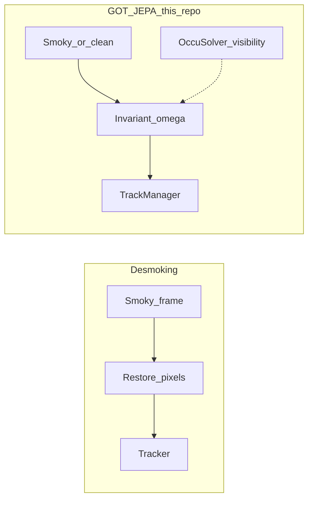
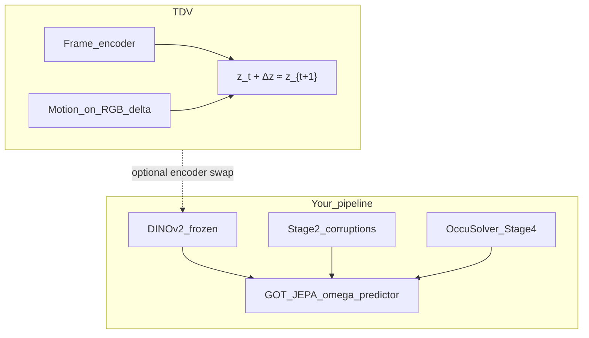

# Repo understanding
_Exported on 6/20/2026 at 05:17:49 GMT+1 from Cursor (3.7.36)_

---

**User**

@Browser can you understand this repo\

---

**Cursor**

Composer. I'll explore the repository structure and key docs to build an accurate picture of the project.


Pulling key docs and entry points to ground the overview.


Creating a structured repository overview from the exploration.


---

**User**

@Browser can you search online across everything and also see the recent VLA-JEPA direction and understand if this is the right way to do things and then also look into  https://smoke.art-ai.me/  but the whole idea is to do surgical tool tracking

---

**Cursor**

Researching VLA-JEPA, surgical tool tracking, and the desmoking work to assess how they fit your MOT pipeline.


Synthesizing findings into a strategic assessment and updating the plan.


**Strategic direction for surgical tool tracking**

> **Given the research landscape, which direction do you want to pursue?**
> - Stay GOT-JEPA course — finish Stage 3/4, smoke-stratified eval (recommended) ✔
> - Stay GOT-JEPA + add desmoking as optional inference ablation branch
> - Hybrid — improve Stage 2 with real smoke pairs + optional desmoking preprocessor
> - Explore VLA-JEPA integration (I understand this is for robot policies, not MOT)

**Composer**

Here is the strategic assessment after comparing your repo against VLA-JEPA, GOT-JEPA, and [Seeing Through Smoke](https://smoke.art-ai.me/).

## Short answer

**Yes — this repo is on the right track for surgical tool MOT.** Stay with GOT-JEPA + OccuSolver. Do not pivot to VLA-JEPA. Treat desmoking as optional later, not the core strategy.

You chose **stay GOT-JEPA → finish Stage 3/4 + smoke-stratified eval**, which matches the research.

---

## VLA-JEPA vs your repo — different problems

[VLA-JEPA](https://arxiv.org/abs/2602.10098) (Feb 2026) pretrains **robot manipulation policies**: Qwen3-VL + V-JEPA2 world model + flow-matching **action head** for LIBERO/DROID/SimplerEnv. It predicts latent states so a robot can output gripper trajectories.

Your repo predicts **track IDs + bounding boxes** via DETR, per-track hypernetwork weights `ω`, ReID, and Hungarian association.

| | VLA-JEPA | Gyanateet_tracking |
|---|---|---|
| Output | End-effector actions | Multi-tool boxes + IDs |
| SSL target | Latent world states | Tracking-model weights `ω` |
| Eval | Manipulation success | HOTA / MOTA on CholecTrack20 |
| Right for surgical MOT? | **No** | **Yes** |

Shared idea: JEPA-style **latent prediction** with leakage-free teacher–student training. Your repo already does that via [GOT-JEPA](https://arxiv.org/abs/2602.14771) in `core_app/mot/jepa.py` — you do not need LeRobot/VLA-JEPA.

---

## GOT-JEPA — your direct lineage (correct choice)

[GOT-JEPA](https://arxiv.org/abs/2602.14771) (Feb 2026) is the paper this repo implements:

- **Teacher** on clean frame → pseudo tracking weights `ω̂`
- **Student** on corrupted frame → must match `ω̂` (invariance under occlusion/smoke/distractors)
- **OccuSolver** — CoTracker visibility → object-aware masks for fine-grained occlusion

Your surgical adaptation in [`core_app/mot/augment.py`](core_app/mot/augment.py) uses domain corruptions (smoke, blood, glare, blur) instead of generic copy-paste. That is the right domain shift from LaSOT/GOT-10k to laparoscopy.

Paper results: 85.3% NPr on LaSOT, strong on AVisT occlusion benchmark. Your multi-tool DETR + TrackManager extension is the necessary surgical specialization GOT-JEPA does not cover out of the box.

---

## Seeing Through Smoke — complementary, not a replacement

[Intuitive’s desmoking work](https://smoke.art-ai.me/) ([arXiv:2603.25867](https://arxiv.org/abs/2603.25867)):

- ViT + physics-inspired head → smoke-free **pixels** + smoke map
- 80K synthetic + 5,817 real da Vinci pairs; ~52 FPS
- **Segmentation IoU improves** (81.15% → 81.81% fine-tuned)
- **Stereo depth does not improve** (baseline beats all desmoking methods)
- **Tool tracking is not directly evaluated** — only seg + depth

Two different strategies for smoke:



**Desmoking** fixes the image. **GOT-JEPA** makes the tracker invariant to corruption and uses OccuSolver for partial visibility — closer to object permanence than pixel restoration.

Risks of making desmoking primary for MOT:
- Distribution shift for DINOv2 (trained on real smoky laparoscopy, not desmoked frames)
- Geometry distortion (hurts Stage 4 VGGT)
- Extra latency stack
- Cleaner pixels ≠ maintained track IDs through re-entry

Worth trying later as an **ablation preprocessor**, not an architectural pivot.

---

## Surgical MOT landscape

- [**SurgiTrack**](https://arxiv.org/html/2405.20333v1) — strong CT20 graph-matching ReID baseline; lacks JEPA occlusion invariance. Useful ideas for out-of-view re-entry in TrackManager.
- [**SurgClean CVPR 2026**](https://openaccess.thecvf.com/content/CVPR2026/html/Pei_Benchmarking_Endoscopic_Surgical_Image_Restoration_and_Beyond_CVPR_2026_paper.html) — restoration benchmark (smoke, fog, splatter); not MOT.
- CholecTrack20 annotates smoke/bleeding/occlusion per frame — you should **stratify HOTA by smoke condition** in eval (not wired yet).

---

## What is right vs what to improve

**Keep:**
- GOT-JEPA Stage 2 SSL with surgical corruptions
- Four-stage progression (scaffold → SSL → joint → OccuSolver/geometry)
- Frozen DINOv2 + Cholec80 SSL with leak-free splits
- OccuSolver in Stage 4 for smoke-as-partial-occlusion

**Improve (without pivoting):**
1. Finish **Stage 3** (9/10 epochs done) from Stage 2 epoch-20 checkpoint
2. Run **Stage 4 lean** — OccuSolver + CoTracker without 5 GB VGGT overhead
3. Add **smoke-stratified eval** on CT20 test
4. Optionally strengthen Stage 2 corruptions with real smoky frames later

**Do not:**
- Pivot to VLA-JEPA
- Replace GOT-JEPA with pixel desmoking as the main strategy
- Skip Stage 4 if smoke/occlusion robustness is the research claim

---

## Confirmed next steps

Per your choice:

1. Complete Stage 3 joint fine-tune on CT20
2. Run Stage 4 (lean recommended first) for OccuSolver visibility
3. Evaluate with smoke-conditioned HOTA breakdown on CT20 test

The updated plan is in the plan file. Say **execute the plan** when you want me to run Stage 3/4 and wire smoke-stratified evaluation.

---

**User**

@Browser plan and check how to use things around here please

---

**Cursor**

Gathering practical usage details from scripts, configs, and docs so we can plan how to run training and eval on this machine.


Creating a practical operations guide for this machine and updating the plan.


**Composer**

Here is a practical guide for using this repo on your DGX Spark setup, based on what is actually on disk and which scripts are trustworthy.

## Your machine right now

| What | Where / status |
|------|----------------|
| Repo | `/home/aimsgroupuol/AIMSgeneral/Gyanateet_tracking` |
| Conda env | `surgi_track` (present) |
| CT20 data | `data/cholectrack20/` |
| SSL corpus | `data/ssl_corpus/` (Stage 2 ready) |
| Cholec80 | `~/data/surgi_world_track/cholec80/cholec80/frames/` |
| Stage 1 | Done — `outputs/mot/cholec20-stage1-supervised/best.pth.tar` |
| Stage 2 | Paused epoch 20/30 |
| Stage 3 | 9/10 epochs — **finish this next** |
| Stage 4 | Epoch 0 only |

---

## Every session — three exports

```bash
cd /home/aimsgroupuol/AIMSgeneral/Gyanateet_tracking
conda activate surgi_track
export PYTHONPATH="${PWD}:${PYTHONPATH}"
export XFORMERS_DISABLED=1   # required on GB10 for DINOv2 torch.hub
```

---

## One entry point for all training

```bash
python -m core_app.mot.main --fname <config.yaml> --devices cuda:0 [flags]
```

Important flags:

- `--debugmode True` — 32 train / 16 val clips (fast debug)
- `--resume <ckpt>` — load checkpoint
- `--start-epoch 0 --reset-optimizer` — **required when starting Stage 3 from Stage 2**

---

## What to run next (Stage 3)

```bash
python -m core_app.mot.main \
  --fname configs/train_mot/dinov2/cholec20-mot-stage3-joint-finetune-vits.yaml \
  --devices cuda:0 \
  --resume outputs/mot/cholec80-ct20-stage2-jepa-pretrain/latest.pth.tar \
  --start-epoch 0 --reset-optimizer
```

Then Stage 4 lean (OccuSolver, GB10-friendly):

```bash
python -m core_app.mot.main \
  --fname configs/train_mot/dinov2/cholec20-mot-stage4-lean.yaml \
  --devices cuda:0 \
  --resume outputs/mot/cholec20-stage3-joint-finetune-vits/best.pth.tar \
  --start-epoch 0 --reset-optimizer
```

---

## Evaluation & demos

**Detection mAP + loss:**

```bash
python scripts/eval_checkpoint.py \
  --config configs/train_mot/dinov2/cholec20-mot-stage3-joint-finetune-vits.yaml \
  --checkpoint outputs/mot/cholec20-stage3-joint-finetune-vits/best.pth.tar \
  --split val --device cuda
```

**Visual inference on frames:**

```bash
python scripts/demo_model_inference.py \
  --video-dir data/cholectrack20/Validation/VID30/Frames \
  --ckpt outputs/mot/cholec20-stage3-joint-finetune-vits/best.pth.tar \
  --max-frames 30 --debug
```

**HOTA/MOTA:** `core_app/mot/eval.py` (needs `trackeval` installed).

**CPU smoke test:** `pytest tests/test_mot_smoke.py -v`

---

## Scripts — use vs avoid

| Use | Avoid (stale) |
|-----|----------------|
| `scripts/train_stage1_gb10_1gpu.sh` | `run_mot_stage3.sh` — uses `dino_wm`, wrong ckpt |
| `scripts/train_stage1_ddp_3gpu.sh` | `run_mot_stage4.sh` — same issues |
| `python -m scripts.build_ssl_corpus` | `run_mot_stage2.sh` — legacy env |

Legacy `run_mot_stage*.sh` scripts target `dino_wm` and ViT-B checkpoint paths. On Spark, use direct `python -m core_app.mot.main` with the **ViT-S** configs (`*-vits.yaml`).

---

## Data env vars (only if paths break)

```bash
export MOT_CHOLEC80_FRAMES_ROOT="$HOME/data/surgi_world_track/cholec80/cholec80/frames"
export MOT_CHOLECTRACK20_ROOT="$PWD/data/cholectrack20"
```

Resolved automatically by [`core_app/data/paths.py`](core_app/data/paths.py) in most cases.

---

## Config map

| Stage | Config | Output folder |
|-------|--------|---------------|
| 1 | `cholec20-mot-stage1-supervised.yaml` | `outputs/mot/cholec20-stage1-supervised/` |
| 2 | `cholec80-ct20-stage2-jepa-pretrain.yaml` | `outputs/mot/cholec80-ct20-stage2-jepa-pretrain/` |
| 3 | `cholec20-mot-stage3-joint-finetune-vits.yaml` | `outputs/mot/cholec20-stage3-joint-finetune-vits/` |
| 4 lean | `cholec20-mot-stage4-lean.yaml` | `outputs/mot/cholec20-stage4-lean-vits/` |

Docs: [`README.md`](README.md), [`docs/TRAINING_STAGES.md`](docs/TRAINING_STAGES.md), [`AGENTS.md`](AGENTS.md).

---

The full operations plan (checkpoint chain, troubleshooting, weekly workflow) is saved in the plan file. Say **execute the plan** when you want me to verify the env, finish Stage 3, run eval, and launch Stage 4 lean.

---

**User**

@Browser can you read about temporal difference vision and see if that fits in any form to what we do here?

---

**Cursor**

Researching temporal-difference vision and comparing it to this repo's GOT-JEPA MOT pipeline.


Updating the plan with a TDV fit analysis against our pipeline.


**Composer**

Here is how [Temporal Difference Vision (TDV)](https://temporal-difference-vision.github.io/) relates to your surgical MOT pipeline.

## What TDV is

[TDV](https://arxiv.org/abs/2606.15956) (Daithankar, Gladstone, LeCun, Ji, 2026) is **self-supervised video encoder pretraining**, not tracking.

Core idea:

```
z_t + motion_encoder(frame_{t+1} − frame_t) ≈ z_{t+1}
```

- **Frame encoder** — scene content (like DINO)
- **Motion encoder** — RGB delta → compact latent motion
- **No augmentations/masking** — only causal next-frame prediction
- **Evaluated on:** optical flow, stereo depth, segmentation — **not MOT/HOTA**

It is in the same broad family as JEPA (latent prediction, not pixels), but targets **general video features**, not per-object track IDs.

---

## Does it fit your repo?

**Not as a replacement for GOT-JEPA.** Different layer of the stack.

| | TDV | Your repo (GOT-JEPA MOT) |
|---|---|---|
| **Goal** | Learn video representations | Track tools with persistent IDs |
| **SSL target** | Next-frame latent `z_{t+1}` | Per-track weights `ω` |
| **Augmentations** | Avoids them | Stage 2 **needs** smoke/blood/blur corruptions |
| **Multi-object** | No | DETR + ReID + Hungarian |
| **Occlusion** | Implicit via flow | OccuSolver + visibility masks |



---

## Where it could help (ranked)

| Option | Fit | Recommendation |
|--------|-----|----------------|
| **Replace GOT-JEPA with TDV** | Poor | Wrong objective — no track IDs |
| **Replace DINOv2 with TDV-pretrained encoder** | Possible long-term | Pretrain TDV on Cholec80, re-run Stages 1–4 — high effort, post-baseline |
| **Motion-delta branch in `PerTrackModelPredictor`** | **Best practical fit** | Fuse `motion_encoder(ΔRGB)` with track history — TDV-inspired ablation after Stage 4 |
| **LD-JEPA-style `Δω` loss in Stage 2** | Moderate | Latent dynamics on predictor weights ([related work](https://arxiv.org/html/2605.17165v1)) |
| **Use with OccuSolver** | Low | CoTracker already handles point motion |

---

## Important tension (and resolution)

TDV argues augmentations hurt at scale. Your Stage 2 in [`core_app/mot/augment.py`](core_app/mot/augment.py) **depends** on surgical corruptions for occlusion invariance in `ω`.

These are not contradictory if you separate layers:

- **TDV** → encoder-level motion-aware features (preserve flow under smoke)
- **GOT-JEPA corruptions** → predictor-level invariance (same `ω` on clean vs smoky frames)

Do **not** drop Stage 2 corruptions in favor of TDV alone.

---

## Also not the same: TD-JEPA (RL)

[TD-JEPA](https://arxiv.org/html/2510.00739v1) uses temporal-difference learning for **RL successor features** — same “TD” name, different problem (robot policies). Same verdict as VLA-JEPA: not for surgical MOT.

---

## Bottom line

| Question | Answer |
|----------|--------|
| Should you pivot to TDV? | **No** — finish GOT-JEPA Stages 3–4 first |
| Does TDV fit at all? | **Yes, as optional future add-on** — motion encoder or TDV-pretrained backbone |
| Best integration point? | Motion-delta auxiliary in `PerTrackModelPredictor` after Stage 4 baseline |
| Replaces OccuSolver / GOT-JEPA? | **No** |

TDV is complementary research for **motion-rich encoders**; your core stack (GOT-JEPA + OccuSolver + DETR + ReID) remains the right primary path for surgical tool tracking.

This analysis is saved in the plan (Section 13). Say **execute the plan** when you want to proceed with Stage 3/4; TDV experiments are marked optional for after that baseline.

