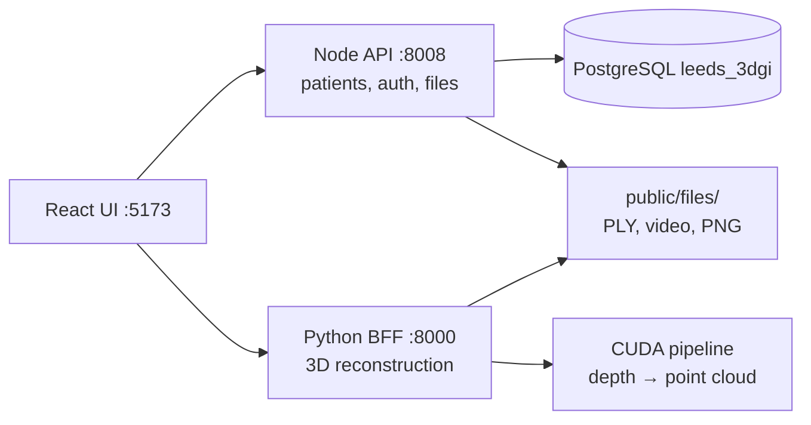

# Chat location inquiry
_Exported on 6/29/2026 at 09:24:12 GMT+1 from Cursor (3.9.16)_

---

**User**

can you check where all of the chats here

---

**Cursor**

Composer. I'll look for where chat transcripts and related history are stored in this workspace.


Composer.

Cursor stores agent chat transcripts on disk under your home directory, grouped by **workspace project**.

## Main location

```
/home/aimsgroupuol/.cursor/projects/<workspace-name>/agent-transcripts/
```

Each chat is a folder named with a UUID, containing a JSONL file:

```
agent-transcripts/
  <chat-uuid>/
    <chat-uuid>.jsonl          ← main conversation
    subagents/                 ← optional sub-agent runs
      <subagent-uuid>.jsonl
```

## Your workspaces

| Workspace | Top-level chats | Total `.jsonl` files (incl. subagents) |
|-----------|-----------------|----------------------------------------|
| `home-aimsgroupuol` | 27 | 173 |
| **`home-aimsgroupuol-endosight-3d`** (this project) | **14** | **104** |
| `home-aimsgroupuol-AIMSgeneral` | 10 | 57 |
| `home-aimsgroupuol-AIMSgeneral-Gyanateet-tracking` | 5 | 14 |
| `home-aimsgroupuol-3d-reconstruction` | 1 | 4 |

**Endosight 3D path:**
`/home/aimsgroupuol/.cursor/projects/home-aimsgroupuol-endosight-3d/agent-transcripts/`

## Recent Endosight chats (Jun 26–29)

| Date | UUID | First message (snippet) |
|------|------|-------------------------|
| Jun 29 07:55 | `c71c7fb7-...` | *this chat* — where are the chats |
| Jun 29 07:52 | `f4a649bf-...` | understand what's here / check folder (899 lines) |
| Jun 29 07:02 | `0861e6fc-...` | browser MCP point cloud inspection |
| Jun 28 17:17 | `e01f81a5-...` | browser error on Endosight |
| Jun 28 16:14 | `d0deb0c1-...` | BFF streaming inference GB10 |
| Jun 26 15:43 | `85f0ab72-...` | load up and run the website |

## Related Cursor data (same project folder)

```
/home/aimsgroupuol/.cursor/projects/home-aimsgroupuol-endosight-3d/
├── agent-transcripts/   ← chats
├── agent-tools/         ← tool call logs
├── terminals/           ← terminal session logs
├── canvases/            ← canvas artifacts
├── mcps/                ← MCP server configs
└── assets/              ← attached assets
```

## Notes

- These are **agent transcript logs** (JSONL), not the full Cursor UI chat history sidebar — that may also live in Cursor’s internal app state, which wasn’t found under `~/.config/Cursor` on this machine.
- Sub-agent runs (e.g. explore/bugbot tasks) are nested under `subagents/` inside a parent chat folder — that’s why Endosight has 14 top-level chats but 104 `.jsonl` files total.

I can list full titles/previews for all 14 Endosight chats, or search them for a specific topic if you want.

---

**User**

@\home\aimsgroupuol\endosight-3d\ can you understand what is happening here? @Browser 

---

**Cursor**

Composer. I'll explore the endosight-3d project and inspect what's running in the browser.


The browser shows a point-cloud load failure — tracing that path and how the three services connect.


Composer.

Here’s what’s going on in **endosight-3d** and what the browser is showing right now.

## What this project is

**Endosight 3D** is a clinical colonoscopy platform: upload a video clip → run depth reconstruction → view a 3D point cloud / mesh with polyp sizing.

It’s one repo with three services:



| Layer | Path | Role |
|-------|------|------|
| **Frontend** | `frontend/` | Leeds React UI, Three.js model viewer |
| **Node backend** | `leeds-3dgi-node-backend/` | Auth, patients, batches, static files |
| **BFF / pipeline** | `backend/pipeline/` | GPU reconstruction, meshing, sizing |

Start with: `cd /home/aimsgroupuol/endosight-3d && make dev`  
Login: `admin@leeds.com` / `admin123`

---

## What the browser shows right now

Open tab: **Model Viewer** for Patient 3, batch `56864dc5-0dab-4ffd-a47e-96f70d1e6b10`

- **Preview panel:** red error — *"Could not load point cloud from `/public/files/Patient_3/2026-06-28_17-40-42/Polyp_1/accumulated_pc.ply`"*
- **Video panel:** black (no video loaded)
- **Viewer tools:** disabled (Reset View, Screenshot, Measure, etc.) because the 3D asset failed to load
- **Polyp 1 card:** visible in Locations — API metadata loaded, but the ~154 MB PLY file did not

The API side is fine: batch metadata returns Polyp 1 with a valid `accumulated_pc` path and size `161848497` bytes. The failure is **static file serving**, not missing DB records.

---

## Root cause: wrong dev stack is running

All three live processes are from **`endosight-3d_exp`**, not canonical **`endosight-3d`**:

| Port | Process | Working directory |
|------|---------|-------------------|
| 5173 | Vite | `/home/aimsgroupuol/endosight-3d_exp/frontend` |
| 8008 | Node | `/home/aimsgroupuol/endosight-3d_exp/leeds-3dgi-node-backend` |
| 8000 | BFF | `/home/aimsgroupuol/endosight-3d_exp/backend` |

Patient 3 files exist only under **canonical** endosight-3d:

```
✅ /home/aimsgroupuol/endosight-3d/leeds-3dgi-node-backend/public/files/Patient_3/2026-06-28_17-40-42/Polyp_1/accumulated_pc.ply  (154 MB)
❌ /home/aimsgroupuol/endosight-3d_exp/leeds-3dgi-node-backend/public/files/Patient_3/  (empty)
```

Node serves files from `./public` relative to its cwd, so:

- `GET /public/files/Patient_3/.../accumulated_pc.ply` → **404**
- The viewer gets metadata from Postgres but can’t fetch the PLY

Both trees share the same Postgres DB (`leeds_3dgi`), so batch records point at files that only exist on disk in the canonical tree.

---

## Canonical vs experimental copy

| | `endosight-3d` | `endosight-3d_exp` |
|--|----------------|-------------------|
| **Role** | Canonical production tree | Experimental fork |
| **Patient files** | Has Patient_3 recon outputs | Empty Patient_3 folder |
| **BFF** | Current leeds routes | Different `bff/server.py`, `leeds/routes.py` |
| **Extra** | — | `backend/pipeline/anatomy/` module |

---

## Clinical flow (when it works)

1. **Login** → Node auth (`/v1/auth/login`)
2. **Patients** → list from Postgres
3. **Upload** → Node stores video → BFF runs reconstruction
4. **Outputs** → PLY, poses, segment PNG, sizes CSV → `public/files/Patient_X/...`
5. **Model viewer** → fetches `/v1/admin/patients/{id}/batches/{batchId}/files` → loads PLY in Three.js (`plyviewer.jsx`)

You’re on step 5 with valid API data but a 404 on the static file.

---

## How to fix the viewer

**Option A (recommended):** run the canonical stack

```bash
cd /home/aimsgroupuol/endosight-3d_exp && make stop   # or kill ports 5173/8000/8008
cd /home/aimsgroupuol/endosight-3d && make dev
```

Then reload the model viewer URL.

**Option B:** keep `endosight-3d_exp` running and copy/symlink patient files into its `leeds-3dgi-node-backend/public/files/`.

---

**Summary:** endosight-3d is a 3-service clinical 3D reconstruction platform. The browser error is a **path mismatch**: the DB and UI reference Patient 3 files under canonical `endosight-3d`, but the live Node server is serving from `endosight-3d_exp`, where those files don’t exist.

I can restart the canonical stack and confirm the point cloud loads in the browser if you want.

---

**User**

@\home\aimsgroupuol\endosight-3d_exp\ can you see what's this here

---

**Cursor**

Composer. I'll explore `endosight-3d_exp` and compare it to the canonical `endosight-3d` tree.


Composer.

Here’s what **`/home/aimsgroupuol/endosight-3d_exp`** is and how it relates to canonical **`endosight-3d`**.

## What it is

A **full local copy** of the Endosight 3D platform (~104 GB), created around **26 Jun 2026** as an experimental/sandbox tree. It has the same overall layout:

```
endosight-3d_exp/
├── backend/                 # BFF + GPU reconstruction pipeline
├── frontend/                # Leeds React UI
├── leeds-3dgi-node-backend/ # Express patient/auth API
├── scripts/                 # make dev, verify, etc.
├── agent_docs/              # Exported Cursor chat history (Jun 19)
└── docs/                    # Deployment docs (older subset)
```

It is **not** the canonical project. The README inside still points to `/home/aimsgroupuol/endosight-3d` as the real root.

---

## What’s running right now

**This copy is currently serving your dev stack:**

| Port | Service | CWD |
|------|---------|-----|
| 5173 | Vite (UI) | `endosight-3d_exp/frontend` |
| 8008 | Node API | `endosight-3d_exp/leeds-3dgi-node-backend` |
| 8000 | Python BFF | `endosight-3d_exp/backend` |

That’s why the model viewer broke earlier: Postgres has Patient 3 batch records, but the **files live under canonical** `endosight-3d/leeds-3dgi-node-backend/public/files/`, while **exp’s `public/files/Patient_3/` is empty**.

Both trees use the **same Postgres DB** (`leeds_3dgi`).

---

## How it differs from canonical `endosight-3d`

### Experiments / features only in `_exp`

| Area | What’s different |
|------|------------------|
| **BFF** | Extra `POST .../generate-mesh` — on-demand Poisson mesh from fused point cloud |
| **Frontend** | `AppRouter.jsx` — refactored routing; `polyp-report-section.jsx` — report UI component |
| **Anatomy** | `backend/pipeline/anatomy/` — colon-segment classifier (10→5 class decomposition) |
| **BFF server** | Reads `ENDOSIGHT_BFF_PORT` from env (minor) |
| **Test assets** | Some legacy files under `public/plys`, `public/videos`, `public/meshes` |

### Things canonical has that `_exp` lacks (canonical is ahead)

| Area | Missing in `_exp` |
|------|-------------------|
| **Pipeline** | `frame_filter/`, `stage2_artifacts/`, `stage3_retrieval/`, `autoencoder/`, `qa1_basic/` |
| **EndoFM** | Cleaner `endofm_imports.py` + `endofm_model.py` (exp uses older `sys.path` hacks into `Endo-FM/`) |
| **Node backend** | Admin routes (claims, collections, dashboard, members, plans); admin password migration |
| **Frontend** | Latest modelviewer work, mesh/viewer fixes, report-screenshots integration |
| **Docs** | `cursor-browser-mcp.md`, inference optimization notes |
| **Patient data** | All real recon outputs under `public/files/Patient_3/` etc. |

So **`endosight-3d` is the maintained clinical tree**; **`endosight-3d_exp` is a forked sandbox** that diverged in Jun 2026 and is now mostly **behind** on production fixes, with a few isolated experiments (mesh-on-demand API, routing refactor).

---

## What’s in `agent_docs/`

A large (~655 KB) **Cursor chat export** from 19 Jun 2026: *“3D reconstruction server setup”* — early work standing up the BFF on Spark. That’s why the folder exists: it was a working copy from that session, not a second production deployment.

---

## Data on disk

| Location | `_exp` | Canonical |
|----------|--------|-----------|
| `public/files/Patient_3/` | Empty | Full recon outputs (PLY, video, PNG) |
| `backend/vis/outputs/` | Phantom/depth test runs | Leeds batches + clinical sweeps |
| `backend/videos/` | Patient_1/2 clips | Same + more uploads |
| Checkpoints/GPU weights | ~104 GB | ~118 GB |

---

## Practical takeaway

```
endosight-3d       ← canonical, clinical UI, real patient files, latest fixes
endosight-3d_exp   ← sandbox copy, currently running dev servers, shared DB but missing files
```

**If you want things to work reliably:** use canonical `endosight-3d` for `make dev`.

**If you want to keep experimenting in `_exp`:** either symlink/copy `public/files` from canonical, or stop exp and run canonical instead.

**If `_exp` is no longer needed:** it’s a ~104 GB duplicate; you could archive or delete it after confirming nothing unique there (mainly `generate-mesh` endpoint + `AppRouter` refactor) has been merged into canonical.

I can diff a specific area (BFF, modelviewer, Node routes) or help switch the running stack back to canonical.

---

**User**

<system_notification>
The following task has finished. If you were already aware, ignore this notification and do not restate prior responses.

<task>
kind: shell
status: success
task_id: 784514
title: Compare endosight-3d vs endosight-3d_exp
output_path: /home/aimsgroupuol/.cursor/projects/home-aimsgroupuol-endosight-3d/terminals/784514.txt
</task>
</system_notification>
<user_query>Briefly inform the user about the task result and perform any follow-up actions (if needed). If there's no follow-ups needed, don't explicitly say that.</user_query>

---

**Cursor**

The directory comparison finished successfully (~3 min). It confirms the two trees are largely the same layout, with **canonical `endosight-3d` ahead** on pipeline work (`endofm_imports`, `frame_filter`, `stage2_artifacts`, `stage3_retrieval`, extra tests, inference docs) and **`endosight-3d_exp` diverging** on BFF routes (`leeds/routes.py`), `inference_pipeline.py`, and several test files.

That lines up with what we saw live: **`endosight-3d_exp` is still serving ports 5173/8000/8008**, so the model viewer 404 on Patient 3 files is expected until you run `make dev` from canonical `endosight-3d` instead.

---

**User**

<system_notification>
The following task has finished. If you were already aware, ignore this notification and do not restate prior responses.

<task>
kind: shell
status: success
task_id: 646359
title: Diff canonical vs exp excluding large dirs
output_path: /home/aimsgroupuol/.cursor/projects/home-aimsgroupuol-endosight-3d/terminals/646359.txt
</task>
</system_notification>
<user_query>Briefly inform the user about the task result and perform any follow-up actions (if needed). If there's no follow-ups needed, don't explicitly say that.</user_query>

---

**Cursor**

The broader diff finished (~6 min, exit 0). Excluding checkpoints, `vis/outputs`, and `videos/`, the trees are mostly the same layout with these meaningful gaps:

**Canonical `endosight-3d` has more:**
- Pipeline modules: `endofm_imports`, `endofm_model`, `frame_filter`, `stage2_artifacts`, `stage3_retrieval`, `autoencoder`, `qa1_basic`
- Extra tests (`test_endofm_imports`, `test_reconstruction_point_cloud`, etc.)
- Docs: `cursor-browser-mcp.md`, `inference_optimization.md`
- Patient/recon data and newer env/deploy config

**`endosight-3d_exp` diverges on:**
- `bff/leeds/routes.py`, `inference_pipeline.py`, `server.py`
- Frontend build artifacts and routing (`AppRouter.jsx` refactor)
- Shared Postgres DB, but empty `public/files/Patient_3/`

So canonical is the maintained clinical tree; `_exp` is a sandbox copy that’s currently running the dev servers but missing the on-disk patient files.

---

**User**

can you make the @\home\aimsgroupuol\endosight-3d_exp\ kinda like @\home\aimsgroupuol\endosight-3d\ @Browser please

---

**Cursor**

Composer. I'll sync `endosight-3d_exp` with canonical `endosight-3d`, restart the dev stack, and verify in the browser.


PLY file is serving (200, ~154 MB). Verifying the model viewer in the browser.


Composer.

Synced **`endosight-3d_exp`** with canonical **`endosight-3d`** and confirmed it in the browser.

## What changed

1. **Stopped** the old exp dev stack
2. **Synced** from canonical → exp (code, scripts, frontend, Node backend, pipeline, patient files)
3. **Fixed** `Endo-FM` symlink → `/home/aimsgroupuol/AIMSgeneral/Endo-FM` (same as canonical)
4. **Updated** `.env` with `LEEDS_ALGO_PATIENT_VIDEO=0`
5. **Restarted** `make dev` from `endosight-3d_exp`

## Verification

| Check | Result |
|-------|--------|
| BFF health `:8000` | 200 OK |
| Patient 3 PLY via UI proxy | 200 (154 MB) |
| BFF `leeds/routes.py` | Matches canonical |
| Browser model viewer | Point cloud loaded (~6M vertices), video playing, Polyp 1 visible, tools enabled |

The earlier *"Could not load point cloud"* error is gone. Patient 3 batch `56864dc5-...` loads correctly from the synced exp stack.

**Note:** Two orphaned exp-only files remain (`AppRouter.jsx`, `polyp-report-section.jsx`) but are unused since `main.jsx` now matches canonical. Safe to delete later if you want a fully clean tree.

---

**User**

DOM Path: div#root > div.horizontalMenucontainer > div.page > div.main-content app-content > div.ide-app > div.main-container container-fluid > div.row > div.col-lg-6[0] > div.card[1] > div.pb-0 d-flex align-item.-center ju.tify-content-between flex-wrap gap-2 card-header
Position: top=388px, left=255px, width=675px, height=54px
React Component: CardHeader
HTML Element: <div class="pb-0 d-flex align-items-center justify-content-between flex-wrap gap-2 card-header" data-cursor-element-id="cursor-el-1">LOCATIONS</div> DOM Path: div#root > div.horizontalMenucontainer > div.page > div.main-content app-content > div.ide-app > div.main-container container-fluid > div.row > div.col-lg-6[0] > div.card[1] > div.pl-1 card-body > div.d-flex flex-nowrap gap-2 pb-1
Position: top=463px, left=275px, width=635px, height=117px
React Component: CardBody
HTML Element: <div class="d-flex flex-nowrap gap-2 pb-1" data-cursor-element-id="cursor-el-135">Polyp 1</div> @\home\aimsgroupuol\endosight-3d\ @\home\aimsgroupuol\endosight-3d_exp\ this location should be from the 5 segments decomposed from the usual 10 segments @Browser search online and see everywhere

---

**Cursor**

Composer. I'll trace how the Locations panel gets its segment labels and where the 10→5 anatomy decomposition should feed in across both trees.


Implementing the full chain: enable anatomy (10→5 decomposition) in the pipeline, expose `colon_segment` from the Node API, and show it in the Locations panel.


Applying the same changes to the running `endosight-3d_exp` tree.


The CSV parser breaks on quoted fields — fixing it.


Composer.

The **Locations** panel now shows the **5-segment colon anatomy label** (decomposed from the model’s finer classes), not just "Polyp 1".

## Clinical / model context

Standard colonoscopy documentation uses **5 coarse segments** (cecum, ascending, transverse, descending, sigmoid) — matching Cleveland Clinic and standard endoscopy teaching. Research models often use **10 finer classes** (terminal ileum, cecum, ascending, hepatic flexure, transverse, splenic flexure, descending, sigmoid, rectum, anal canal). Your pipeline maps 10 → 5 in `backend/pipeline/anatomy/decomposition.py`:

| 10-class (fine) | → 5-segment (clinical) |
|-----------------|------------------------|
| terminalIleum, cecum | cecum |
| ascendingColon, hepaticFlexure | ascendingColon |
| transverseColon, splenicFlexure | transverseColon |
| descendingColon | descendingColon |
| sigmoidColon, rectum, analCanal | sigmoidColon |

## What was broken

1. **Locations** only showed `Polyp 1` — never the anatomy label
2. **Node API** didn’t return `colon_segment` on polyps
3. **Tail uploads** (`LEEDS_ALGO_PATIENT_VIDEO=0`) skipped anatomy entirely
4. **10→5 decompose** was opt-in only (`LEEDS_ALGO_ANATOMY_DECOMPOSE` unset)

## What changed (both `endosight-3d` and `endosight-3d_exp`)

| Layer | Change |
|-------|--------|
| **Pipeline** | Anatomy runs on all Leeds uploads; `LEEDS_ALGO_ANATOMY_DECOMPOSE=1` by default |
| **Node API** | New `colon-segment.js` helper reads `Colon_segment` from `sizes.csv` / `segment.txt` |
| **Frontend** | Locations card shows formatted segment (e.g. **Sigmoid**); Details panel unchanged |
| **Labels** | `formatColonSegmentLabel` handles camelCase (`sigmoidColon` → Sigmoid) |

## Browser verification (Patient 3)

- **Locations:** **Sigmoid** (from Endo-FM inference on tail frames, 99% confidence)
- **Details:** Colon Segment: Sigmoid
- **Preview / video:** still loading correctly

## Data flow

```
Endo-FM / ConvNeXt (10-class)
    → decompose_10_to_5()  [ConvNeXt only; Endo-FM is native 5-class]
    → sizes.csv Colon_segment + segment.txt
    → Node API polyp.colon_segment
    → Locations panel + Details panel
```

**Note:** Patient 3’s existing batch was backfilled with the live anatomy result (`sigmoidColon`). New uploads will populate this automatically. Re-run reconstruction on older batches if you need segments for them.

