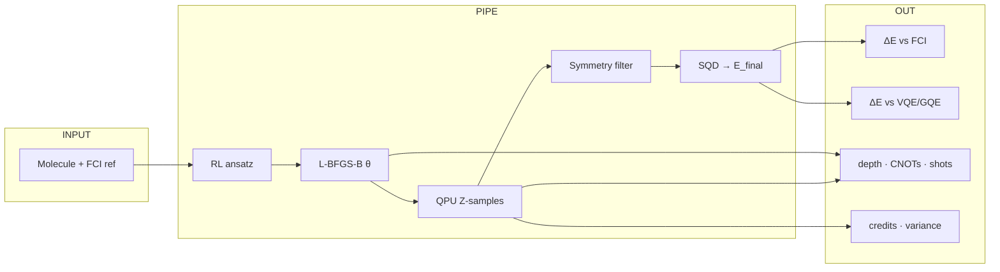
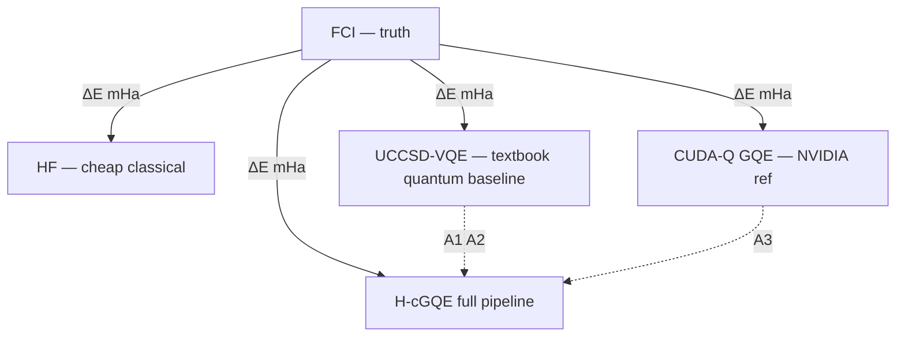

# H-cGQE × GIC 2026 — Ablation Map (metrics + meaning)

> **Ablation** = same molecules · same shots · same seeds — swap **one** component and compare.

## What we measure (glossary)

| Metric | Formula / unit | Good looks like | What it **means** |
|---|---|---|---|
| **ΔE vs FCI** | \|E − E_FCI\| in **mHa** | ≤ **1.6 mHa** (≈1 kcal/mol) | Distance from **exact** ground state in this active space |
| **Chemical accuracy** | ΔE ≤ 1.6 mHa | ✓ per molecule | “Chemically meaningful” energy (standard QC bar) |
| **ΔE vs VQE/GQE** | E_ours − E_baseline (mHa) | Negative = we’re lower | Head-to-head vs **challenge baselines** |
| **Circuit depth** | gates after transpile | Lower | Shallower → less NISQ noise accumulation |
| **2-qubit count** | CNOT/CZ count | Lower | Dominant error source on superconducting QPUs |
| **# Pauli ops / # circuits** | count | Lower | Fewer measurements → cheaper QPU + less shot budget |
| **Shots** | N | Fixed across ablations | Fair comparison; drives statistical error |
| **Shot variance** | σ(E) across seeds | Lower | Stable estimator; noisy if high |
| **Valid-shot %** | symmetry-passing / total | Higher | How much raw QPU data is physically usable |
| **Unique determinants** | \|subspace\| | Enough to converge | Did sampling explore useful Slater configs? |
| **Subspace size R** | # determinants in H_sub | Matched in controls | Fair SQD vs random comparison |
| **QPU credits** | qBraid credits | Lower at same ΔE | **Cost** of hardware evidence |
| **Optimizer steps** | L-BFGS-B iters | Fewer to same ΔE | Classical post-cost on HPC |
| **Training stability** | loss curve, collapse? | Smooth convergence | RL actually learned, didn’t memorize |

**GIC Phase 3 asks for:** simulation accuracy + benchmarks vs **classical baselines** ([pqic.org/challenge](https://www.pqic.org/challenge)) — we report **energy**, **cost**, and **NISQ feasibility** together.

## Full pipeline → metrics

## vs VQE / GQE (challenge framing)

## Ablation table — measure · swap · interpret

| ID | Swap **one** thing | **Measure** | If **better** (full wins) | If **worse** (ablated wins) |
|:--:|---|---|---|---|
| **A1** | ansatz → **UCCSD-VQE** | ΔE vs FCI · depth · 2Q gates · optimizer iters | RL circuits are **shorter** and/or **more accurate** than standard VQE | Stick with VQE; our ansatz search didn’t help |
| **A2** | ansatz → **ADAPT-VQE** | ΔE · gate growth curve · # iterations | RL matches adaptive VQE with **less** classical optimization | ADAPT still stronger on hard molecules |
| **A3** | policy → **CUDA-Q GQE** | ΔE · # operators · wall time | DAPO RL **beats** shipped GQE baseline | NVIDIA GQE is enough; RL overhead unjustified |
| **A4** | post → **QWC raw ⟨H⟩** | ΔE · σ across seeds · # circuits | SQD is **more stable** than direct Pauli sums | SQD adds complexity without gain |
| **A5** | samples → **random dets** (same R) | ΔE at matched R | QPU/sim sampling **selects** good determinants | Sampling is no better than random — QPU role weak |
| **A6** | noise → ideal → shot → noisy Aer | ΔE · valid % · unique dets | Noise hurts but SQD **recovers** bound | Hardware noise kills subspace quality |
| **A7** | filter OFF | ΔE · invalid-shot % | Symmetry filter is **free mitigation** | Raw shots already clean enough |
| **A8** | θ fixed at 0.01 | ΔE gap (mHa) | L-BFGS-B **recovers** large energy gap | Fixed angles already near optimum |
| **A9** | RL → random Pauli words | ΔE · entanglement fraction | RL finds **structured** circuits, not noise | Any circuit works — RL unnecessary |
| **A10** | no SFT warm-start | final E · training curve | SFT prevents **collapse** on large q | Cold-start RL is fine |

**Priority:** **A1–A3** (classical/VQE/GQE baselines) · **A4–A5** (NISQ + SQD story).

## Readout cheat sheet (for your friend)

| Observation | Physics / engineering takeaway |
|---|---|
| ΔE ≤ 1.6 mHa on a molecule | **Chemical accuracy** achieved for that system |
| H-cGQE ΔE < UCCSD-VQE ΔE | We beat the **standard quantum baseline** the challenge expects |
| H-cGQE ΔE < CUDA-Q GQE ΔE | Our **RL policy** improves over NVIDIA reference GQE |
| SQD ΔE < QWC raw ΔE | **Subspace diagonalization** beats noisy expectation values |
| SQD ≪ random at same R | QPU is doing **useful selection**, not lottery |
| Depth/CNOT ↓ at same ΔE | More **NISQ-runnable** on Rigetti / IonQ |
| Valid-shot % ↑ after filter | Symmetry postselection = **error mitigation without extra circuits** |
| σ(E) ↓ with more shots | Need more shots for **stable** energy (report alongside ΔE) |
| E_SQD ≥ E_FCI always | **Variational bound** holds — SQD math is consistent |
| Credits ↓ at same ΔE | Hybrid HPC+AI+QPU is **cost-efficient** vs brute-force QPU |

## One question → one row

| Friend asks… | Point to… |
|---|---|
| “What is an ablation?” | Top note + swap one row in table |
| “What are we measuring?” | Glossary table |
| “vs VQE?” | **A1**, **A2** + ΔE vs FCI |
| “Why SQD?” | **A4–A7** + readout row “SQD ≪ random” |
| “What does winning look like?” | ΔE ≤ 1.6 mHa **and** beat VQE/GQE **and** lower depth/shots |
